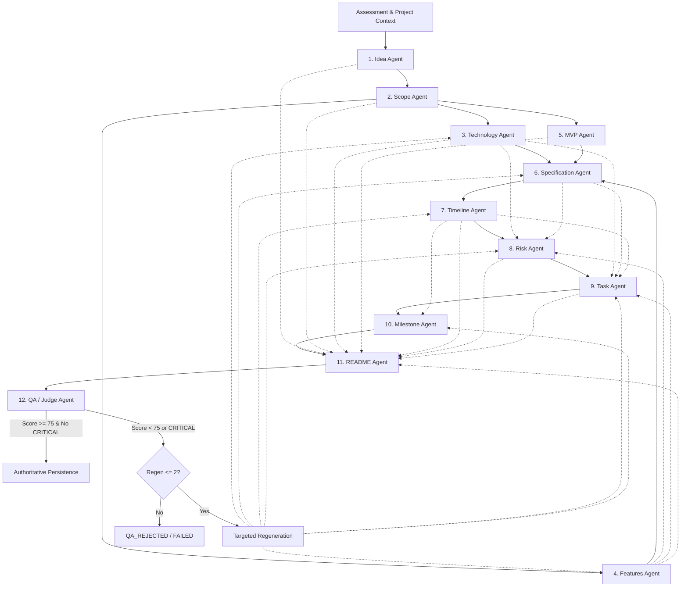

# Gate 09 — Unit 2 Analysis
## Agent Contracts, Pydantic Schemas & Context Builder

**Document ID:** `GF-GATE09-UNIT2-ANALYSIS`  
**Status:** ANALYSIS ONLY — AWAITING REVIEW  
**Date:** 2026-09-20  
**Workspace:** `d:\PROJECTS\Infosys SpringBoot\growflow_ai`  
**Branch:** `gate-09/ai-blueprint`  
**Authoritative References:**  
- GrowFlow Part 6F — AI Agent Architecture & Orchestration (Final Frozen Specification)
- GrowFlow Part 6E — AI Provider Gateway & Model Architecture (Final Frozen Specification)
- Gate 09 Specification & Gate 09 Specification Resolution (`docs/gate09_spec_resolution.md`)
- Gate 09 Unit 1 Analysis (`docs/gate09_unit1_analysis.md`)
- Gate 09 Unit 1 Implementation Evidence (`docs/implementation/GATE_09_UNIT_1_EVIDENCE.md`)

---

## 1. Executive Summary

### 1.1 Purpose of Unit 2
Unit 2 establishes the formal contract and context foundations required before implementing the 12 specialized AI agents (Unit 3) and their LangGraph orchestration with durable execution (Unit 4). 

The central conceptual boundary established by this unit is:

```text
Project / Assessment Data (PostgreSQL)
                ↓
    Project Context Builder
                ↓
    Typed Agent Input Context
                ↓
          Agent Contract
                ↓
        Typed Agent Output
                ↓
  Next Agent / LangGraph State
```

Unit 2 guarantees that when Unit 3 builds the 12 real agents, no agent relies on:
- loose, untyped dictionaries;
- implicit execution state or hidden globals;
- undocumented or polymorphic fields;
- arbitrary, uncontrolled database queries;
- leaked cross-project or cross-student data.

### 1.2 Boundary Confirmation
This analysis is strictly **ANALYSIS ONLY**.
- **NO** production code has been modified.
- **NO** test code has been modified.
- **NO** database migrations or schema alterations have been created.
- **NO** frontend code has been touched.
- **NO** AI agents, LangGraph graphs, durable workers, SSE endpoints, or RAG pipelines have been implemented.
- **NO** git commits, pushes, or pull requests have been initiated.

### 1.3 Readiness Verdict
Based on the thorough audit of the codebase, the completed Unit 1 gateway implementation, and the frozen Part 6E/6F specifications:
**READY FOR UNIT 2 IMPLEMENTATION**

---

## 2. Current Repository State

### 2.1 Completed Unit 1 Gateway Foundation
Gate 09 Unit 1 delivered a production-ready, centralized AI Provider Gateway in `backend/app/infrastructure/ai/`:
- **`AIProviderGateway`:** Centralized execution gateway decoupling application logic from HTTP transport. Provides both raw text execution and typed schema execution via `execute_structured(schema: type[T], ...)`.
- **`AIModelPolicy`:** Enforces logical capability resolution (`FAST`, `STANDARD`, `REASONING`, `EMBEDDING`) and the non-downgrade fallback hierarchy ($\text{REASONING} \ge \text{STANDARD} \ge \text{FAST}$).
- **`APIKeyPoolManager`:** Maintains in-memory health state (`ACTIVE`, `RATE_LIMITED`, `COOLDOWN`, `FAILED`, `DISABLED`) across a 5-key OpenRouter pool with automatic cooldown recovery and safe logging aliases (`key_1` through `key_5`).
- **`OpenRouterAdapter` & `MockAIProviderAdapter`:** Production HTTP client with exponential backoff/jitter and a zero-credential mock adapter for deterministic unit testing.
- **Structured Synthesis Engine:** Cleans markdown JSON fences (` ```json ... ``` `), parses JSON, and validates models using Pydantic v2 `model_validate_json(...)`, raising `AISchemaValidationException` on validation failure.
- **Verification:** All 21 gateway unit tests pass (`backend/tests/unit/test_ai_gateway.py`), and all 170 backend tests remain 100% green.

### 2.2 Existing Blueprint Domain & Application Services
- **`backend/app/domain/blueprint/models.py`:**
  - Defines `BlueprintStatus` (`NOT_STARTED`, `GENERATING`, `GENERATED`, `VALIDATING`, `QA_REJECTED`, `READY_FOR_APPROVAL`, `APPROVED`, `FAILED`).
  - Defines `BlueprintQAStatus` (`PENDING`, `PASS`, `FAIL`).
  - Defines `BlueprintSectionKey` (10 canonical keys: `project_profile`, `tech_stack`, `features`, `specifications`, `mvp`, `duration`, `risks`, `tasks`, `milestones`, `readme`).
  - Defines domain models `BlueprintSession`, `BlueprintQAFeedback`, and `BlueprintIssue`.
- **`backend/app/infrastructure/database/models/blueprint.py`:**
  - `BlueprintModel`: Persistent table `blueprints` (one record per `project_instance_id`), storing `content: JSONB`, `qa_feedback: JSONB`, `qa_score: Integer`, `status: String`, and `current_step: String`.
  - `BlueprintJobModel`: Persistent table `blueprint_jobs` for tracking asynchronous runs.
- **`backend/app/application/services/blueprint_service.py`:**
  - Currently contains legacy/mock synthetic generation (`_synthesize_section`), assembling hardcoded dictionaries sequentially.
  - Contains deterministic rule-based QA judge (`_evaluate_qa_judge`) and Markdown rendering (`compile_section_to_markdown`, `compile_master_blueprint`).
  - Contains rudimentary context assembly (`_assemble_project_context`) returning an untyped dictionary.

### 2.3 Existing Project & Assessment Domain State
- **`backend/app/infrastructure/database/models/project.py`:**
  - `ProjectInstanceModel`: Contains `id`, `student_id`, `group_id`, `name`, `problem`, `proposed_solution`, `complexity`, `current_phase`, `health`, `progress_percentage`.
  - `ProjectProfileModel`: Contains `objective`, `target_users`, `project_type`, `student_skill_context`, `goals`, `scope`, `expected_outcome`, `constraints`, `assumptions`, `context`.
  - `ProjectTechnologyModel`: Contains `category`, `purpose`, `why_selected`, `appropriateness`, `student_understanding`.
- **`backend/app/infrastructure/database/models/assessment.py`:**
  - `AssessmentSessionModel`: Completed assessment session (`status == "COMPLETED"`).
  - `AssessmentAnswerModel`: Submitted student answers (`question_id`, `question_text`, `selected_option`, `text_response`).
  - `AssessmentResultModel`: Persisted Enriched Project Understanding (EPU): `skill_level`, `project_complexity`, `alignment`, `technical_confidence`, `learning_depth`, `overall_score`, `readiness_tier`, `dimension_scores`, `identified_gaps`, `recommendations`.

### 2.4 Codebase Gaps Addressed by Unit 2
1. **Absence of Typed Agent Contracts:** The existing system stores and passes blueprint sections as untyped `dict[str, Any]`. There are no Pydantic models defining the exact input requirements or output schemas for the 12 agents.
2. **Absence of Shared Workflow State:** There is no typed representation of the LangGraph execution state (`TypedDict` or `BaseModel`) to carry intermediate agent outputs, execution metadata, and QA scorecard.
3. **Absence of a Centralized Context Builder:** The existing `BlueprintService._assemble_project_context` is an internal private method returning a flat, unvalidated dictionary that dumps all answers indiscriminately. There is no isolated, testable `ProjectContextBuilder` service capable of generating purpose-built contexts per agent.
4. **Absence of Formal Provenance Contracts:** While Unit 1 returns `AIExecutionResult` with provider-level metrics (`latency_ms`, `usage`, `key_alias`), there is no contract linking agent-level metadata (`agent_name`, `agent_version`, `prompt_version`, `generation_number`, `regeneration_attempt`) into execution state.

---

## 3. Frozen Architecture References

| Reference | Scope & Authority | Status |
|---|---|---|
| **GrowFlow Part 6F** | Defines 12-agent architecture (§2, §4), responsibility principle (§3), typed contract concept (§5), canonical blueprint graph (§8), parallel branch (§10), state vs database boundary (§12–14), context architecture (§15–24), QA/Judge gate (§30–31), targeted regeneration (§32–36), and security isolation (§89–90). | **FROZEN** |
| **GrowFlow Part 6E** | Centralized AI Provider Gateway (§6), provider capability policy (§18), five-key pool (§10–13), structured output execution (§44). | **FROZEN** |
| **Gate 09 Decision A1** | Exact agent graph topology: `IDEA → SCOPE → [TECH ∥ FEATURES ∥ MVP] → SPECIFICATION → TIMELINE → RISK → TASK → MILESTONE → README → QA/JUDGE`. Task $\to$ Milestone is strictly serial. | **FROZEN** |
| **Gate 09 Decision A2** | Exactly one canonical blueprint record per project instance (`blueprints` table). Generation attempts identified by `generation_number` and `job_id`. | **FROZEN** |
| **Gate 09 Decision A3** | QA pass criteria: `score >= 75` and zero `CRITICAL` findings. Maximum automatic targeted regeneration attempts: `2`. Severity taxonomy: `INFO`, `WARNING`, `ERROR`, `CRITICAL`. | **FROZEN** |
| **Gate 09 Decision A4** | No silent capability downgrade ($\text{REASONING} \ge \text{STANDARD} \ge \text{FAST}$). `QUOTA_EXHAUSTED` when capacity is unavailable. | **FROZEN** |
| **Gate 09 Decision A5** | Cancellation lifecycle: `CANCELLING → CANCELLED` two-step state machine. | **FROZEN** |

---

## 4. Existing Contract/Schema Audit

### 4.1 Existing Schemas in the Repository
```text
backend/app/
├── api/schemas/
│   ├── blueprint.py
│   │   ├── BlueprintIssueSchema (BaseModel)
│   │   ├── BlueprintQAFeedbackSchema (BaseModel)
│   │   ├── BlueprintGenerationProgressSchema (BaseModel)
│   │   ├── BlueprintStatusResponse (BaseModel)
│   │   ├── BlueprintContentResponse (BaseModel)
│   │   ├── BlueprintGeneratePayload (BaseModel)
│   │   ├── BlueprintRetryPayload (BaseModel)
│   │   └── BlueprintApproveResponse (BaseModel)
│   └── workspace.py & workspace_extensions.py
│       ├── BlueprintDocumentSummarySchema (BaseModel)
│       ├── BlueprintDocumentSchema (BaseModel)
│       └── BlueprintVersionResponse (BaseModel)
└── domain/blueprint/models.py
    ├── BlueprintIssue (dataclass)
    ├── BlueprintQAFeedback (dataclass)
    └── BlueprintSession (dataclass)
```

### 4.2 Structural Gaps
- **No Agent Input Models:** Existing application code expects either a database model or an ad-hoc dictionary. No typed Pydantic models define what `IdeaAgent`, `ScopeAgent`, etc., require to execute.
- **No Agent Output Models:** `blueprint.content` is defined as `dict[str, Any]` in SQLAlchemy and Pydantic. The internal schemas (e.g. what fields a `TechStack` section or `GranularTasks` section must contain) are only enforced informally via hardcoded python dictionaries.
- **No Execution State Schema:** LangGraph requires an explicit typed state structure to track node transitions and accumulate partial outputs.
- **No Validation Against LLM Output:** Unit 1's `execute_structured(schema: type[T], ...)` requires a concrete Pydantic subclass `T`. Without Unit 2's output models, `execute_structured` cannot be called by any agent.

---

## 5. 12-Agent Contract Matrix

The 12 logical agents approved in Gate 09 Decision A1 each require explicit input and output Pydantic contracts. Below is the comprehensive contract matrix.



### 5.1 Common Contract Base Classes
To ensure strict uniformity, all agent contracts inherit from standard base classes:
- **`BaseAgentInput(BaseModel)`:**
  - `execution_id: str` (FROZEN)
  - `project_id: uuid.UUID` (FROZEN)
  - `student_id: uuid.UUID` (FROZEN)
  - `agent_name: str` (FROZEN)
  - `contract_version: str = "1.0.0"` (FROZEN)
  - `regeneration_attempt: int = 0` (FROZEN)
  - `qa_feedback_hint: str | None = None` (PROPOSED — carries targeted feedback during regeneration)
- **`BaseAgentOutput(BaseModel)`:**
  - `agent_name: str` (FROZEN)
  - `contract_version: str = "1.0.0"` (FROZEN)
  - `summary: str` (FROZEN — concise executive summary of this agent's synthesis)
  - `confidence_score: float = Field(default=1.0, ge=0.0, le=1.0)` (PROPOSED — uncertainty expression)
  - `assumptions: list[str] = Field(default_factory=list)` (FROZEN)
  - `warnings: list[str] = Field(default_factory=list)` (FROZEN)

---

### 5.2 Agent Contract Specifications (1 through 12)

#### 1. Idea Agent
- **A. Purpose:** Synthesizes, clarifies, and refines the core project concept, problem statement, and value proposition based on the student's initial definition and assessment results.
- **B. Input Contract:** `IdeaAgentInput(BaseAgentInput)`
  - `project_name: str` (REQUIRED)
  - `initial_problem: str` (REQUIRED)
  - `initial_solution: str` (REQUIRED)
  - `complexity_preference: str` (REQUIRED)
  - `student_skill_level: str` (REQUIRED — from Assessment EPU)
  - `assessment_readiness_tier: str` (REQUIRED)
  - `assessment_recommendations: list[str]` (OPTIONAL)
- **C. Output Contract:** `IdeaAgentOutput(BaseAgentOutput)`
  - `refined_title: str` (REQUIRED)
  - `vision_statement: str` (REQUIRED)
  - `problem_statement: str` (REQUIRED)
  - `proposed_solution: str` (REQUIRED)
  - `target_users: list[str]` (REQUIRED)
  - `value_propositions: list[str]` (REQUIRED)
  - `core_domain: str` (REQUIRED)
- **D. Value Constraints:** `target_users` min 1 item; `value_propositions` min 2 items.
- **E. Dependencies:** Upstream: Context Builder. Downstream: Scope Agent, README Agent.
- **F. Persistence & QA:** Persisted as part of `project_profile` section. QA/Judge evaluates clarity and problem alignment.

#### 2. Scope Agent
- **A. Purpose:** Establishes rigid project boundaries, explicit in-scope items, out-of-scope exclusions, constraints, and success criteria.
- **B. Input Contract:** `ScopeAgentInput(BaseAgentInput)`
  - `idea: IdeaAgentOutput` (REQUIRED)
  - `assessment_gaps: list[str]` (OPTIONAL — areas student is weak in)
- **C. Output Contract:** `ScopeAgentOutput(BaseAgentOutput)`
  - `in_scope: list[str]` (REQUIRED, min 3 items)
  - `out_of_scope: list[str]` (REQUIRED, min 2 items)
  - `architectural_boundaries: list[str]` (REQUIRED, min 2 items)
  - `technical_constraints: list[str]` (REQUIRED)
  - `assumptions: list[str]` (REQUIRED)
  - `deliverable_outcomes: list[str]` (REQUIRED)
- **D. Value Constraints:** Explicit separation of in-scope vs out-of-scope to prevent scope creep.
- **E. Dependencies:** Upstream: Idea Agent. Downstream: Technology, Features, MVP (parallel branch), README Agent.
- **F. Persistence & QA:** Persisted in `project_profile` section. QA/Judge checks for scope ambiguity or over-ambitious boundaries.

#### 3. Technology Agent (Parallel Branch 1/3)
- **A. Purpose:** Recommends concrete, coherent technology stack selections across all architectural tiers, explaining rationale, appropriateness, and student learning curve.
- **B. Input Contract:** `TechnologyAgentInput(BaseAgentInput)`
  - `idea: IdeaAgentOutput` (REQUIRED)
  - `scope: ScopeAgentOutput` (REQUIRED)
  - `student_skill_level: str` (REQUIRED)
  - `preferred_technologies: list[str]` (OPTIONAL — from project instance if present)
- **C. Output Contract:** `TechnologyAgentOutput(BaseAgentOutput)`
  - `backend: TechItem` (REQUIRED)
  - `database: TechItem` (REQUIRED)
  - `frontend: TechItem` (REQUIRED)
  - `communication_protocols: list[str]` (REQUIRED)
  - `security_auth: TechItem` (REQUIRED)
  - `telemetry_observability: TechItem` (REQUIRED)
  - `third_party_services: list[TechItem]` (OPTIONAL)
  - `justification_matrix: list[TechJustification]` (REQUIRED)
  *(Where `TechItem` has: `name: str`, `version: str | None`, `role: str`, `rationale: str`, `learning_curve: str` ["LOW", "MODERATE", "STEEP"])*
- **D. Value Constraints:** Technology choices must be mutually compatible and appropriate for student skill level.
- **E. Dependencies:** Upstream: Scope Agent. Downstream: Specification, Risk, Task, README.
- **F. Persistence & QA:** Persisted in `tech_stack` section. QA/Judge validates compatibility (e.g. FastAPI + React + PostgreSQL).

#### 4. Features Agent (Parallel Branch 2/3)
- **A. Purpose:** Decomposes the scope into modular, prioritized capabilities with explicit priority classifications.
- **B. Input Contract:** `FeaturesAgentInput(BaseAgentInput)`
  - `idea: IdeaAgentOutput` (REQUIRED)
  - `scope: ScopeAgentOutput` (REQUIRED)
- **C. Output Contract:** `FeaturesAgentOutput(BaseAgentOutput)`
  - `features: list[FeatureItem]` (REQUIRED, min 4 items)
  *(Where `FeatureItem` has: `feature_id: str` [regex `^F\d{2}$`], `title: str`, `description: str`, `priority: FeaturePriority` ["P0", "P1", "P2" or "MUST", "SHOULD", "GOOD_TO_HAVE"], `module: str`, `user_story: str`, `dependencies: list[str]`)*
- **D. Value Constraints:** Must contain at least two `P0` features; feature IDs must be deterministic and unique.
- **E. Dependencies:** Upstream: Scope Agent. Downstream: Specification, Risk, Task, README.
- **F. Persistence & QA:** Persisted in `features` section. QA/Judge checks that all `P0` features align with in-scope items.

#### 5. MVP Agent (Parallel Branch 3/3)
- **A. Purpose:** Defines the minimal verifiable slice of the project for Stage 1 validation, detailing core user journey, validation criteria, and technical baseline.
- **B. Input Contract:** `MVPAgentInput(BaseAgentInput)`
  - `idea: IdeaAgentOutput` (REQUIRED)
  - `scope: ScopeAgentOutput` (REQUIRED)
  - `research_evidence: list[ResearchSource] | None` (OPTIONAL — grounded research from Tavily if used)
- **C. Output Contract:** `MVPAgentOutput(BaseAgentOutput)`
  - `mvp_name: str` (REQUIRED)
  - `core_user_journey: list[str]` (REQUIRED, min 3 steps)
  - `included_capabilities: list[str]` (REQUIRED)
  - `excluded_from_mvp: list[str]` (REQUIRED)
  - `validation_criteria: list[str]` (REQUIRED)
  - `minimum_viable_architecture: str` (REQUIRED)
- **D. Value Constraints:** MVP must be achievable within early project phases.
- **E. Dependencies:** Upstream: Scope Agent. Downstream: Specification, README.
- **F. Persistence & QA:** Persisted in `mvp` section. QA/Judge validates lean footprint and testability.

#### 6. Specification Agent
- **A. Purpose:** Synthesizes the parallel outputs (Tech, Features, MVP) into actionable technical specifications, data models, and API interfaces.
- **B. Input Contract:** `SpecificationAgentInput(BaseAgentInput)`
  - `idea: IdeaAgentOutput` (REQUIRED)
  - `scope: ScopeAgentOutput` (REQUIRED)
  - `technology: TechnologyAgentOutput` (REQUIRED)
  - `features: FeaturesAgentOutput` (REQUIRED)
  - `mvp: MVPAgentOutput` (REQUIRED)
- **C. Output Contract:** `SpecificationAgentOutput(BaseAgentOutput)`
  - `entities: list[DataEntitySpec]` (REQUIRED, min 2 entities)
  - `api_endpoints: list[APIEndpointSpec]` (REQUIRED, min 3 endpoints)
  - `integration_flows: list[IntegrationFlowSpec]` (REQUIRED)
  - `system_acceptance_criteria: list[str]` (REQUIRED)
  *(Where `DataEntitySpec` has: `entity_name: str`, `fields: list[FieldSpec]`, `relationships: list[str]`; `APIEndpointSpec` has: `path: str`, `method: str`, `description: str`, `auth_required: bool`, `request_payload_summary: str | None`, `response_summary: str`)*
- **D. Value Constraints:** Endpoints and entities must directly support `P0` features and chosen database/backend.
- **E. Dependencies:** Upstream: Technology, Features, MVP (Synchronization point). Downstream: Timeline, Risk, Task, README.
- **F. Persistence & QA:** Persisted in `specifications` section. QA/Judge checks technical precision and contract integrity.

#### 7. Timeline / Duration Agent
- **A. Purpose:** Structures the development lifecycle into phased sprints, establishing start/completion projections, milestone targets, and duration estimates based on complexity.
- **B. Input Contract:** `TimelineAgentInput(BaseAgentInput)`
  - `idea: IdeaAgentOutput` (REQUIRED)
  - `specification: SpecificationAgentOutput` (REQUIRED)
  - `complexity: str` (REQUIRED)
  - `project_deadline_weeks: int | None` (OPTIONAL, default=12)
- **C. Output Contract:** `TimelineAgentOutput(BaseAgentOutput)`
  - `estimated_total_weeks: int` (REQUIRED)
  - `phases: list[TimelinePhase]` (REQUIRED, min 3 phases)
  - `critical_path_summary: str` (REQUIRED)
  *(Where `TimelinePhase` has: `phase_number: int`, `name: str`, `duration_weeks: int`, `focus_area: str`, `deliverables: list[str]`, `dependencies: list[int]`)*
- **D. Value Constraints:** Sum of `duration_weeks` across phases must equal `estimated_total_weeks`.
- **E. Dependencies:** Upstream: Specification. Downstream: Risk, Task, Milestone, README.
- **F. Persistence & QA:** Persisted in `duration` section. QA/Judge checks realistic duration for the student's tier.

#### 8. Risk Agent
- **A. Purpose:** Conducts systematic technical, operational, architectural, and security risk assessments, providing concrete mitigation strategies and warning signs.
- **B. Input Contract:** `RiskAgentInput(BaseAgentInput)`
  - `technology: TechnologyAgentOutput` (REQUIRED)
  - `features: FeaturesAgentOutput` (REQUIRED)
  - `specification: SpecificationAgentOutput` (REQUIRED)
  - `timeline: TimelineAgentOutput` (REQUIRED)
- **C. Output Contract:** `RiskAgentOutput(BaseAgentOutput)`
  - `risks: list[RiskItem]` (REQUIRED, min 4 risks)
  *(Where `RiskItem` has: `risk_id: str` [regex `^R\d{2}$`], `category: RiskCategory` ["TECHNICAL", "OPERATIONAL", "INTEGRATION", "SCOPE", "SECURITY"], `title: str`, `severity: SeverityLevel` ["HIGH", "MEDIUM", "LOW"], `likelihood: str` ["HIGH", "MEDIUM", "LOW"], `impact_description: str`, `warning_signs: list[str]`, `mitigation_strategy: str`, `fallback_plan: str`)*
- **D. Value Constraints:** Must include at least one Technical and one Security risk; severity must be valid enum.
- **E. Dependencies:** Upstream: Timeline (and upstream Tech, Features, Spec). Downstream: Task, README.
- **F. Persistence & QA:** Persisted in `risks` section. QA/Judge checks risk realism against stack and features.

#### 9. Task Agent
- **A. Purpose:** Generates an actionable, granular work breakdown structure (WBS) with task ordering, domain categories, priority levels, and explicit dependencies.
- **B. Input Contract:** `TaskAgentInput(BaseAgentInput)`
  - `specification: SpecificationAgentOutput` (REQUIRED)
  - `technology: TechnologyAgentOutput` (REQUIRED)
  - `features: FeaturesAgentOutput` (REQUIRED)
  - `timeline: TimelineAgentOutput` (REQUIRED)
  - `risks: RiskAgentOutput` (REQUIRED)
- **C. Output Contract:** `TaskAgentOutput(BaseAgentOutput)`
  - `tasks: list[TaskItem]` (REQUIRED, min 8 tasks)
  *(Where `TaskItem` has: `task_id: str` [regex `^T\d{2}$`], `title: str`, `description: str`, `category: str` ["SETUP", "DATABASE", "BACKEND", "FRONTEND", "INTEGRATION", "TESTING", "DEPLOYMENT"], `priority: str` ["P0", "P1", "P2"], `estimated_hours: int`, `dependencies: list[str]` [references earlier `task_id`s], `feature_id: str | None`)*
- **D. Value Constraints:** Dependency graph among tasks must be a Directed Acyclic Graph (DAG) with no cyclic references; setup tasks must precede implementation tasks.
- **E. Dependencies:** Upstream: Risk, Specification, Timeline. Downstream: Milestone (strictly serial!), README.
- **F. Persistence & QA:** Persisted in `tasks` section. QA/Judge validates dependency topological order and completeness.

#### 10. Milestone Agent
- **A. Purpose:** Groups tasks and timeline phases into gate deliverables and evaluation milestones.
- **B. Input Contract:** `MilestoneAgentInput(BaseAgentInput)`
  - `timeline: TimelineAgentOutput` (REQUIRED)
  - `tasks: TaskAgentOutput` (REQUIRED — Milestone strictly depends on Task!)
- **C. Output Contract:** `MilestoneAgentOutput(BaseAgentOutput)`
  - `milestones: list[MilestoneItem]` (REQUIRED, min 3 milestones)
  *(Where `MilestoneItem` has: `milestone_id: str` [regex `^M\d{1,2}$`], `name: str`, `target_week: int`, `deliverables: list[str]`, `associated_task_ids: list[str]`, `verification_criteria: str`, `gate_decision: str` ["GATE_1_FOUNDATION", "GATE_2_CORE_MVP", "GATE_3_POLISH_HANDOFF"])*
- **D. Value Constraints:** `associated_task_ids` must refer to valid `task_id` values from the Task Agent.
- **E. Dependencies:** Upstream: Task Agent (serial), Timeline Agent. Downstream: README, QA/Judge.
- **F. Persistence & QA:** Persisted in `milestones` section. QA/Judge checks that all P0 tasks are covered in milestone deliverables.

#### 11. README Agent
- **A. Purpose:** Synthesizes the finalized, validated architectural decisions into a comprehensive project README and setup guide.
- **B. Input Contract:** `ReadmeAgentInput(BaseAgentInput)`
  - Curated summary of all 10 upstream agent outputs (Idea, Scope, Tech, Features, MVP, Spec, Timeline, Risk, Task, Milestone).
- **C. Output Contract:** `ReadmeAgentOutput(BaseAgentOutput)`
  - `project_title: str` (REQUIRED)
  - `project_tagline: str` (REQUIRED)
  - `overview: str` (REQUIRED)
  - `architecture_overview: str` (REQUIRED)
  - `tech_stack_summary: dict[str, str]` (REQUIRED)
  - `getting_started: list[str]` (REQUIRED — ordered setup commands)
  - `environment_variables: list[EnvVarSpec]` (REQUIRED)
  - `contributing_guidelines: str` (REQUIRED)
- **D. Value Constraints:** Clean markdown formatting without missing variables.
- **E. Dependencies:** Upstream: Milestone (and all earlier validated outputs). Downstream: QA/Judge.
- **F. Persistence & QA:** Persisted in `readme` section. QA/Judge checks alignment with technology choices.

#### 12. QA / Judge Agent
- **A. Purpose:** Acts as the automated gatekeeper evaluating all 10 synthesized outputs against semantic coherence, contract validity, contradiction absence, and gate thresholds.
- **B. Input Contract:** `QAJudgeAgentInput(BaseAgentInput)`
  - `all_agent_outputs: dict[str, Any]` (REQUIRED — all 11 previous outputs)
  - `project_context: ProjectBaseContext` (REQUIRED)
  - `assessment_context: AssessmentContext` (REQUIRED)
  - `regeneration_attempt: int` (REQUIRED)
- **C. Output Contract:** `QAJudgeAgentOutput(BaseAgentOutput)`
  - `status: BlueprintQAStatus` (REQUIRED — `PASS` or `FAIL`)
  - `overall_score: int` (REQUIRED — 0..100)
  - `summary: str` (REQUIRED)
  - `evaluated_criteria: dict[str, int]` (REQUIRED — scores for completeness, consistency, feasibility, stack_coherence, task_validity)
  - `findings: list[QAFinding]` (REQUIRED)
  - `recommendations: list[str]` (REQUIRED)
  - `regeneration_target: str | None` (REQUIRED if FAIL, identifying the specific failing agent or section)
  - `requires_human_review: bool` (REQUIRED — True if max regenerations exceeded or unrecoverable contradiction)
- **D. Value Constraints:** Gate 09 Decision A3 enforced: `overall_score >= 75` AND zero `CRITICAL` findings required for `PASS`.
- **E. Dependencies:** Upstream: All agents (1 through 11). Downstream: LangGraph conditional edge (`PASS` $\to$ persist; `FAIL` $\to$ targeted regeneration).
- **F. Persistence & QA:** Persisted directly into `blueprints.qa_score` and `blueprints.qa_feedback`.

---

## 6. Shared Agent State Analysis

The shared LangGraph execution state coordinates the workflow. The table below audits each candidate state field against authoritative architecture classifications:

| State Field | Python Type | Classification | Category | Description |
|---|---|---|---|---|
| `project_id` | `uuid.UUID` | **FROZEN** | Canonical | Scoping ID for project instance. Must be verified against auth. |
| `student_id` | `uuid.UUID` | **FROZEN** | Canonical | Owner student ID. Must be verified against authenticated token. |
| `generation_number` | `int` | **FROZEN** | Canonical | Monotonically increasing attempt counter on the blueprint. |
| `execution_id` | `str` | **FROZEN** | Transient | Unique ID for this specific LangGraph execution run. |
| `correlation_id` | `str` | **FROZEN** | Transient | Distributed tracing ID linking all logs and gateway calls. |
| `assessment_context` | `AssessmentContext` | **FROZEN** | Transient | Pre-fetched, immutable assessment context. |
| `project_context` | `ProjectBaseContext` | **FROZEN** | Transient | Pre-fetched, immutable base project metadata. |
| `current_step` | `str` | **EXISTING** | Transient | Currently executing agent or phase. |
| `agent_outputs` | `dict[str, Any]` | **FROZEN** | Transient | Dictionary accumulating typed outputs of completed agents. |
| `agent_execution_metadata`| `dict[str, AgentExecutionProvenance]` | **FROZEN** | Transient | Latency, tokens, model, key alias, and attempt per agent. |
| `qa_findings` | `list[QAFinding]` | **FROZEN** | Transient | Accumulated QA findings from the evaluation node. |
| `qa_score` | `int \| None` | **EXISTING** | Transient/Durable | Evaluated score from QA/Judge (0..100). |
| `qa_status` | `BlueprintQAStatus` | **EXISTING** | Transient/Durable | Current QA decision (`PENDING`, `PASS`, `FAIL`). |
| `regeneration_attempt` | `int` | **FROZEN** | Transient | Counter tracking automatic retries (bounded at 2). |
| `regeneration_target` | `str \| None` | **FROZEN** | Transient | Agent name or section key flagged for replacement. |
| `cancellation_requested`| `bool` | **FROZEN** | Transient | Flag signaling worker cancellation request. |
| `workflow_status` | `str` | **FROZEN** | Transient | Workflow state machine (`RUNNING`, `VALIDATING`, `COMPLETED`, etc.). |
| `errors` | `list[str]` | **FROZEN** | Transient | List of fatal error strings if workflow aborts. |
| `timestamps` | `dict[str, datetime]`| **PROPOSED** | Transient | Start/end timestamps for profiling workflow nodes. |

### 6.1 State Boundaries
1. **Canonical State:** `project_id`, `student_id`, and `generation_number`. Stored in PostgreSQL; survives execution restarts.
2. **Transient Execution State:** All other fields live in memory within the LangGraph runtime state.
3. **Frontend Untrusted Fields:** `student_id`, `generation_number`, `qa_score`, `qa_status`, `project_context`. The frontend provides *only* `project_id` and optional `force_regenerate: bool`. All other fields must be derived deterministically from the database and authenticated user token.
4. **Durable Survival:** In Unit 4, execution state will be serialized to checkpoints so long-running executions can resume across worker restarts.

---

## 7. Project Context Builder Analysis

### 7.1 Architecture of the Context Builder
In accordance with Part 6F §15–24, agents must never receive raw database queries, global dumps, or irrelevant entities. The `ProjectContextBuilder` is a centralized, deterministic service responsible for fetching, validating, sanitizing, and packaging data into typed context objects.

```text
PostgreSQL Repositories
├── ProjectRepository
│   ├── get_by_id(project_id)
│   ├── get_profile(project_id)
│   └── list_technologies(project_id)
└── AssessmentRepository
    ├── get_by_project_id(project_id)
    ├── get_answers(assessment_id)
    └── get_result_by_assessment_id(assessment_id)
            ↓
    ProjectContextBuilder
            ↓
  Enforce Student Tenancy & Scoping
  Filter Mentor Notes & Private Data
  Apply Token Budget / Summarization
            ↓
┌─────────────────────────────────────────────────────────────┐
│ Purpose-Built Typed Context Packages                        │
│ ├── ProjectBaseContext (Common to all agents)               │
│ ├── AssessmentContext (Assessment results & answers)        │
│ ├── IdeaAgentContext (Base + Skill + Initial concept)       │
│ ├── TechnologyAgentContext (Base + Scope + Constraints)     │
│ ├── SpecificationAgentContext (Tech + Features + MVP)       │
│ └── ...                                                     │
└─────────────────────────────────────────────────────────────┘
```

### 7.2 Data Sources & Isolation Table

| Context Element | Primary Data Source | Repository Providing It | Scope / Isolation Rule |
|---|---|---|---|
| Project Metadata | `project_instances` | `ProjectRepository` | Scoped strictly to `project_id` and `student_id`. |
| Project Profile | `project_profiles` | `ProjectRepository` | 1-to-1 with `project_instances.id`. |
| Student Assessment EPU | `assessment_results` | `AssessmentRepository` | 1-to-1 with completed assessment for this project. |
| Student Assessment Answers | `assessment_answers` | `AssessmentRepository` | Questions & responses for this project only. |
| Selected Technologies | `project_technologies` | `ProjectRepository` | Existing manual preferences for this project. |
| Upstream Agent Outputs | LangGraph Execution State | In-Memory Workflow State | Scoped strictly to the active `execution_id`. |

### 7.3 Data Excluded from Agent Context
The Context Builder strictly strips the following elements before any prompt synthesis:
- Mentor private notes (`project_mentor_notes`) and internal evaluation logs.
- Other students' project data, group peer details, or platform-wide benchmarks.
- Raw database primary keys and foreign keys not required for reasoning.
- Passwords, JWT secrets, OpenRouter API keys, or infrastructure credentials.
- Unstructured, raw error dumps from previous failed executions.

### 7.4 Context Construction Strategy: Single Fetch vs Purpose-Built Packages
- **Strategy:** Single Fetch $\to$ Filtered Projections.
- At workflow initiation, the Context Builder executes two optimized async queries (one for Project entities, one for Assessment entities).
- It caches this in the shared execution state as `ProjectBaseContext` and `AssessmentContext`.
- For each agent node, the Context Builder provides a dedicated projection method (e.g. `build_technology_context(state)`) that selects only the required fields. This prevents redundant database roundtrips while enforcing context minimalism.

---

## 8. Security & Data Isolation Analysis

### 8.1 Tenancy & Ownership Enforcement
The AI model is never the security boundary. Authorization is deterministically enforced in Python before data reaches the model or context builder:

```text
HTTP Request (Bearer JWT)
        ↓
FastAPI Security Dependency (CurrentUser)
        ↓
Application / Context Service
        ↓
Ownership Verification:
project.student_id == current_user.user_id (or current_user.is_admin)
        ↓
PASS: Build Context & Execute
FAIL: Raise AuthorizationException (HTTP 403)
```

### 8.2 Prevention of Cross-Project Contamination
1. **Tenant-Scoped Repository Methods:** Repositories must query with explicit filters: `WHERE project_instances.id = :project_id AND project_instances.student_id = :student_id`.
2. **Context Builder Parameterization:** The Context Builder takes `current_user: CurrentUser` and verifies project ownership prior to assembling any context.
3. **Execution State Isolation:** Every LangGraph execution operates in a fresh memory namespace keyed by a newly generated `execution_id`. No global variables or shared module caches hold project context.
4. **Tool Access Restrictions:** Any tools invoked during execution (such as Tavily web search) receive sanitised queries containing only technical domain terms, never student identities, emails, or internal database IDs.

---

## 9. Provenance Contract

Every agent execution produces a structured provenance record captured in `AgentExecutionProvenance`. This satisfies Part 6F §92 and enables full auditability in the Admin AI Observatory.

```python
class AgentExecutionProvenance(BaseModel):
    """Execution provenance for a single agent node run."""
    agent_name: str
    agent_version: str = "1.0.0"
    prompt_version: str = "1.0.0"
    contract_version: str = "1.0.0"
    generation_number: int
    regeneration_attempt: int = 0
    execution_id: str
    correlation_id: str
    provider: str
    model: str
    key_alias: str  # Safe alias (e.g. "key_1"), NEVER raw API key
    capability: ProviderCapability
    latency_ms: float
    usage: AIUsageMetadata  # prompt_tokens, completion_tokens, total_tokens, cost_estimate_usd
    retry_count: int  # HTTP/Provider retries during this execution
    status: str  # "SUCCESS", "FAILED", "RETRYING"
    started_at: datetime
    completed_at: datetime
```

---

## 10. Structured Output Contracts & Unit 1 Compatibility

### 10.1 Pydantic Model Hierarchy
All output models inherit from `BaseAgentOutput`, ensuring consistent attributes across the entire graph.

```text
BaseModel
  └── BaseAgentOutput
        ├── IdeaAgentOutput
        ├── ScopeAgentOutput
        ├── TechnologyAgentOutput
        ├── FeaturesAgentOutput
        ├── SpecificationAgentOutput
        ├── MVPAgentOutput
        ├── TimelineAgentOutput
        ├── RiskAgentOutput
        ├── TaskAgentOutput
        ├── MilestoneAgentOutput
        ├── ReadmeAgentOutput
        └── QAJudgeAgentOutput
```

### 10.2 Compatibility with Unit 1 `execute_structured(...)`
In Unit 1, `AIProviderGateway.execute_structured` was built with the following signature:
```python
async def execute_structured(
    self,
    schema: type[T],
    prompt: str,
    system_prompt: str = "You are the GrowFlow Architectural Intelligence Engine.",
    capability: ProviderCapability = ProviderCapability.STANDARD,
    model: str | None = None,
    temperature: float = 0.2,
    max_tokens: int = 4000,
    timeout_seconds: float | None = None,
    correlation_id: str | None = None,
    execution_id: str | None = None,
) -> AIExecutionResult[T]: ...
```

Unit 2's output schemas are 100% compatible:
1. Every output contract is a pure Pydantic v2 `BaseModel` subclass.
2. Standard Pydantic types (`str`, `int`, `float`, `bool`, `list`, `dict`, `Enum`) are used.
3. Unit 1's `_clean_json_markdown_fences` handles stripping any surrounding markdown fences (` ```json `), and calls `schema.model_validate_json(cleaned_json)`.
4. If validation fails, `AISchemaValidationException` is raised, allowing the agent/orchestrator to handle targeted recovery.

---

## 11. Markdown Representation Boundary

The frozen architecture establishes:
> **Structured backend state is canonical. Generated Markdown is a representation.**

Agents produce structured Pydantic data. Markdown documents are rendered deterministically from this structured data, never the reverse.

| Canonical Structured Object | Rendered Document Key | Document Title | Renderer Function |
|---|---|---|---|
| `IdeaAgentOutput` + `ScopeAgentOutput` | `project_profile` | Project Profile & Domain Context | `compile_project_profile_md(idea, scope)` |
| `TechnologyAgentOutput` | `tech_stack` | Technology Stack & Architecture | `compile_tech_stack_md(tech)` |
| `FeaturesAgentOutput` | `features` | Core Features & System Modules | `compile_features_md(features)` |
| `SpecificationAgentOutput` | `specifications` | Technical Specifications & Data Models | `compile_specifications_md(spec)` |
| `MVPAgentOutput` | `mvp` | MVP Scope & Validation Criteria | `compile_mvp_md(mvp)` |
| `TimelineAgentOutput` | `duration` | Timeline & Sprint Duration | `compile_duration_md(timeline)` |
| `RiskAgentOutput` | `risks` | Technical Risks & Mitigations | `compile_risks_md(risks)` |
| `TaskAgentOutput` | `tasks` | Granular Work Breakdown | `compile_tasks_md(tasks)` |
| `MilestoneAgentOutput` | `milestones` | Stage Milestones & Gate Deliverables | `compile_milestones_md(milestones)` |
| `ReadmeAgentOutput` | `readme` | README & Setup Guide | `compile_readme_md(readme)` |
| All 10 Canonical Sections | `full` | Complete Master Blueprint | `compile_master_blueprint_md(all_sections)` |

### Architectural Invariants:
1. Markdown is rendered downstream of Pydantic validation and QA pass.
2. The database stores the structured JSON in `blueprints.content`.
3. Markdown is never parsed back into structured models.

---

## 12. Regeneration Contract

### 12.1 Approved Rules (Gate 09 Decision A3)
- **Pass Threshold:** `score >= 75` AND `count(CRITICAL) == 0`.
- **Max Automatic Targeted Regenerations:** `2`.
- **Severity Levels:** `INFO`, `WARNING`, `ERROR`, `CRITICAL`.

### 12.2 Regeneration Flow
```text
QA / Judge Evaluation
        ↓
    Score < 75 OR has CRITICAL finding?
        ├── NO  → PASS → Persist to Database → COMPLETED
        └── YES → FAIL
                     ↓
         Regeneration Attempt < 2?
             ├── YES → Targeted Regeneration
             │            ↓
             │       Identify failing agent from QAFinding.target_agent
             │            ↓
             │       Invalidate downstream dependent agent outputs
             │            ↓
             │       Re-run target agent with QA feedback hint
             │            ↓
             │       Re-run invalidated downstream agents
             │            ↓
             │       Re-evaluate with QA / Judge (increment attempt count)
             └── NO  → Transition to QA_REJECTED / FAILED (Human Review Required)
```

### 12.3 Preserving Last Valid State
If regeneration fails or exceeds 2 attempts:
- Any previously `APPROVED` blueprint snapshot in `project_blueprint_versions` remains completely untouched and active.
- The active blueprint session transitions to `BlueprintStatus.QA_REJECTED` or `BlueprintStatus.FAILED`.
- Incomplete AI outputs are never promoted to the authoritative version.

---

## 13. QA / Judge Contract

### 13.1 Severity Taxonomy
- **`INFO`:** Stylistic observation, minor wording recommendation. Does not lower score significantly; never blocks pass.
- **`WARNING`:** Minor structural gap, potential stretch goal ambiguity. May lower score by 2–5 points; does not block pass alone.
- **`ERROR`:** Inconsistency between sections (e.g. task references an undefined feature). Deducts 10–20 points; blocks pass if score falls below 75.
- **`CRITICAL`:** Fatal contradiction, total missing section, severe scope violation, or unachievable architecture. **Always blocks pass immediately**, regardless of numeric score.

### 13.2 QA Contract Schema
```python
class QASeverity(StrEnum):
    INFO = "INFO"
    WARNING = "WARNING"
    ERROR = "ERROR"
    CRITICAL = "CRITICAL"


class QAFinding(BaseModel):
    finding_id: str
    section: str
    target_agent: str
    severity: QASeverity
    category: str  # "SCHEMA", "CONTRADICTION", "SCOPE_VIOLATION", "TECH_MISMATCH", etc.
    description: str
    recommendation: str
    requires_regeneration: bool = False


class QAJudgeAgentOutput(BaseAgentOutput):
    status: BlueprintQAStatus  # PASS or FAIL
    overall_score: int = Field(ge=0, le=100)
    summary: str
    evaluated_criteria: dict[str, int] = Field(default_factory=dict)
    findings: list[QAFinding] = Field(default_factory=list)
    recommendations: list[str] = Field(default_factory=list)
    regeneration_target: str | None = None
    requires_human_review: bool = False
```

---

## 14. Context Size & Token Boundary

### 14.1 Token Budget Allocation
Uncontrolled context growth degrades reasoning and risks provider quota exhaustion. The following budgets are allocated:

| Agent | Input Context Token Budget | Output Token Budget | Model Capability |
|---|---|---|---|
| Idea Agent | ~2,000 tokens | ~1,000 tokens | `STANDARD` |
| Scope Agent | ~2,500 tokens | ~1,200 tokens | `STANDARD` |
| Technology Agent | ~3,000 tokens | ~1,500 tokens | `STANDARD` |
| Features Agent | ~3,000 tokens | ~2,000 tokens | `STANDARD` |
| MVP Agent | ~2,500 tokens | ~1,200 tokens | `STANDARD` |
| Specification Agent | ~4,000 tokens | ~2,500 tokens | `STANDARD` |
| Timeline Agent | ~3,000 tokens | ~1,500 tokens | `STANDARD` |
| Risk Agent | ~3,500 tokens | ~1,500 tokens | `STANDARD` |
| Task Agent | ~4,000 tokens | ~2,500 tokens | `STANDARD` |
| Milestone Agent | ~3,000 tokens | ~1,500 tokens | `STANDARD` |
| README Agent | ~4,500 tokens | ~2,500 tokens | `STANDARD` |
| QA / Judge Agent | ~6,000 tokens | ~2,000 tokens | `REASONING` or `STANDARD` |

### 14.2 Context Reduction Rules
1. **Field Projection:** Downstream agents receive only the necessary structured fields from upstream agents (e.g. Task Agent receives Feature titles, IDs, and priorities, not full feature narrative user stories).
2. **Deterministic Truncation:** Assessment answers are limited to questions directly impacting architecture; long-form text responses exceeding 500 characters are safely summarized or truncated with indicator.
3. **No Redundant Repetition:** Upstream narrative text is not re-echoed through every intermediate agent node.

---

## 15. Database Boundary

### 15.1 Zero Database Migrations Policy
- **No database migrations are permitted or required for Unit 2.**
- The existing relational schema (`blueprints`, `blueprint_jobs`, `project_instances`, `project_profiles`, `project_technologies`, `assessments`, `assessment_answers`, `assessment_results`, `project_blueprint_versions`) fully supports Unit 2 contract definitions and context assembly.

### 15.2 Future Unit 4 Persistence
During Unit 4 (LangGraph Orchestration & Durable Execution), a persistent table `agent_executions` will be introduced to persist `AgentExecutionProvenance` records across workers. That migration belongs strictly to Unit 4.

---

## 16. Unit 1 Compatibility

The contracts designed in Unit 2 integrate seamlessly with Unit 1:
1. **Schema-Generic Invocation:**
   ```python
   # Inside Unit 3 agent implementation:
   result = await gateway.execute_structured(
       schema=TechnologyAgentOutput,
       prompt=prompt_text,
       system_prompt=system_prompt_text,
       capability=ProviderCapability.STANDARD,
       correlation_id=state["correlation_id"],
       execution_id=state["execution_id"],
   )
   typed_output: TechnologyAgentOutput = result.content
   ```
2. **Direct Provenance Capture:**
   Unit 1's `AIExecutionResult` returns `latency_ms`, `usage`, `key_alias`, and `retry_count`. These map 1-to-1 into Unit 2's `AgentExecutionProvenance`.
3. **Key Pool & Policy Independence:**
   Agents never import or reference `APIKeyPoolManager`, `OpenRouterAdapter`, or raw HTTP utilities. They depend solely on `AIProviderGateway`.

---

## 17. Test Strategy

The test suite for Unit 2 requires a minimum meaningful test matrix covering contract validation, context assembly, and security isolation without testing live LLM endpoints.

### 17.1 Test Matrix

| Category | Test Suite | Scenarios to Cover | Target Verification |
|---|---|---|---|
| **Contract Validation** | `test_agent_contracts.py` | - All 12 agent input and output models instantiated with valid data.<br>- Required field enforcement (omitted required field raises `ValidationError`).<br>- Enum constraints (`FeaturePriority`, `RiskCategory`, `QASeverity`).<br>- Regex constraints on IDs (`^F\d{2}$`, `^T\d{2}$`, `^M\d{1,2}$`, `^R\d{2}$`).<br>- Serialization and deserialization via `.model_dump_json()` and `.model_validate_json()`. | Pydantic model integrity |
| **Context Builder** | `test_context_builder.py` | - Context assembled successfully from mock repositories.<br>- Project profile and assessment EPU correctly mapped.<br>- Missing assessment answers handled gracefully.<br>- Agent-specific context projections contain only specified fields.<br>- Context token sizing stays within budget boundaries. | Data projection correctness |
| **Security & Isolation** | `test_project_isolation.py` | - Context assembly with mismatched `student_id` raises `AuthorizationException`.<br>- Non-existent `project_id` raises `NotFoundException`.<br>- Mentor notes and administrative secrets strictly absent from assembled context.<br>- Context for Project A contains zero data from Project B. | Tenancy and isolation |
| **QA Contract** | `test_qa_contract.py` | - Score $\ge 75$ with zero `CRITICAL` findings yields `PASS`.<br>- Score $\ge 75$ with one `CRITICAL` finding yields `FAIL`.<br>- Score $< 75$ yields `FAIL`.<br>- Bounded regeneration target correctly identifies failing agent. | Decision rule compliance |
| **Gateway Compatibility**| `test_contract_gateway_compat.py` | - Models validate mock JSON responses generated by `MockAIProviderAdapter`.<br>- Markdown code block stripping works seamlessly with all 12 schemas. | Unit 1 integration |

---

## 18. Exact Unit 2 Scope

| Item | Scope Classification | Rationale |
|---|---|---|
| 12 Agent Input Pydantic Schemas | **IN SCOPE** | Core Unit 2 deliverable. |
| 12 Agent Output Pydantic Schemas | **IN SCOPE** | Core Unit 2 deliverable. |
| Shared Agent Execution State Model | **IN SCOPE** | Required typed structure for workflow coordination. |
| Project Context Builder Service | **IN SCOPE** | Centralized, isolated context extraction service. |
| Provenance & Execution Models | **IN SCOPE** | Standardized metadata contract. |
| QA / Judge Contract & Severity Enums | **IN SCOPE** | Approved Gate 09 evaluation contract. |
| Markdown Compilation Specifications | **IN SCOPE** | Defining document boundaries and projection rules. |
| Comprehensive Unit Tests | **IN SCOPE** | Validating schemas, context builder, and isolation. |
| 12 AI Agent Implementations | **OUT OF SCOPE** | Belongs to Unit 3. |
| Tool Implementations (Tavily, RAG) | **OUT OF SCOPE** | Belongs to Unit 3. |
| LangGraph StateGraph & Nodes | **OUT OF SCOPE** | Belongs to Unit 4. |
| Durable Job Runner & Checkpoints | **OUT OF SCOPE** | Belongs to Unit 4. |
| Database Migrations | **OUT OF SCOPE** | Belongs to Unit 4. |
| Markdown Renderers Implementation | **OUT OF SCOPE** | Existing implementations in `BlueprintService` preserved; refined in Unit 4. |
| SSE Streaming Endpoints | **OUT OF SCOPE** | Belongs to Unit 5. |
| Frontend Blueprint UI | **OUT OF SCOPE** | Belongs to Gate 09 Unit 6. |

---

## 19. File-Level Impact

### 19.1 New Files Proposed for Unit 2 Implementation
To maintain clean architecture and modularity, contracts and context builders are organized under `backend/app/domain/ai/`:

```text
backend/app/domain/ai/
├── __init__.py
├── contracts/
│   ├── __init__.py
│   ├── base.py              # BaseAgentInput, BaseAgentOutput, Provenance models
│   ├── agents.py            # The 11 generator agent input & output Pydantic schemas
│   ├── qa.py                # QAJudgeAgentInput, QAJudgeAgentOutput, QAFinding, QASeverity
│   └── state.py             # BlueprintWorkflowState (TypedDict & BaseModel)
└── context/
    ├── __init__.py
    ├── models.py            # Typed context projection models (ProjectBaseContext, AssessmentContext, etc.)
    └── builder.py           # ProjectContextBuilder service class
```

### 19.2 New Test Files Proposed
```text
backend/tests/unit/
├── test_agent_contracts.py  # Contract validation, enums, regexes, serialization
├── test_context_builder.py  # Context builder projection and repository aggregation
├── test_project_isolation.py# Tenancy checks, auth boundary, secret exclusion
└── test_qa_contract.py      # QA scoring rules, critical severity gate, regeneration target
```

### 19.3 Existing Files Modified
- **NONE.** Unit 2 introduces purely additive, non-breaking contract models and context builder services. Existing application services (`BlueprintService`) and infrastructure remain untouched until Unit 4 wire-up.

### 19.4 Existing Files That Must NOT Be Modified
- `backend/app/infrastructure/ai/*` (Unit 1 is verified and frozen).
- `backend/app/infrastructure/database/models/*` (No schema changes in Unit 2).
- `backend/migrations/*` (No database migrations).
- `frontend/*` (No UI changes).

---

## 20. Dependency Analysis

### 20.1 Current Environment Inspection
- **Python:** 3.12.
- **Pydantic:** v2.x (installed and active).
- **LangGraph & LangChain:** Already present in `requirements.txt` and `.venv`.
- **SQLAlchemy:** 2.0 async (installed).
- **Pytest:** Active with `pytest-asyncio`.

### 20.2 Verdict
**Zero new Python dependencies are required for Unit 2.** Standard library `typing`, `enum`, `uuid`, `datetime`, and `pydantic` v2 provide all necessary primitives.

---

## 21. Risks / Failure Modes

| Risk | Impact | Detection | Mitigation |
|---|---|---|---|
| **Contract Drift** | Schemas change without updating agents, causing runtime `ValidationError`. | Automated Pydantic contract unit tests run on every commit. | Strict semantic versioning on contracts (`contract_version = "1.0.0"`). |
| **LLM Schema Non-Compliance** | Model generates markdown wrappers or omits nested fields. | Unit 1 `execute_structured` catches validation errors via `AISchemaValidationException`. | Gateway strips markdown fences; system prompts include explicit JSON schema representations. |
| **Context Explosion** | Excessive token count in context builder causes slow inference or quota exhaustion. | Token estimation assertions in context builder tests. | Hard token budgets per agent; field projection filters out narrative bloat. |
| **Cross-Project Leakage** | Bug in context builder exposes Student A's answers to Student B. | Automated security unit tests (`test_project_isolation.py`). | Deterministic authorization checks before database queries; explicit `student_id` WHERE clauses. |
| **Regeneration Deadlock** | QA/Judge repeatedly flags an issue, looping infinitely. | State tracking tests. | Hard cap of `max_regenerations = 2` enforced in workflow state machine. |
| **Circular Imports** | Inter-agent contracts import each other recursively. | Ruff linting and mypy static analysis. | All shared contracts live in `backend/app/domain/ai/contracts/base.py`; agents never import peer agent files. |

---

## 22. Unit 3 Handoff

Unit 2 provides the exact specifications that Unit 3 will build against:
1. **Concrete Pydantic Classes:** Unit 3 agents will import their specific input and output contracts (e.g. `from backend.app.domain.ai.contracts.agents import TechnologyAgentInput, TechnologyAgentOutput`).
2. **Gateway Schema Parameter:** Unit 3 agents will invoke `gateway.execute_structured(schema=TechnologyAgentOutput, ...)`.
3. **Strict Validation Rules:** Unit 3 agents do not need to implement custom parsing logic; Pydantic handles validation automatically.
4. **Tool Interfaces:** Defines where tools (such as Tavily for `MVPAgent`) attach into agent reasoning without bypassing contracts.

---

## 23. Unit 4 Handoff

Unit 2 provides the structural foundation for Unit 4 (LangGraph Orchestration & Durable Execution):
1. **`BlueprintWorkflowState` Definition:** Typed dictionary defining every key that LangGraph's `StateGraph` will manage.
2. **Dependency Edge Specifications:** Defines the exact node dependencies for the graph topology (`IDEA → SCOPE → [TECH ∥ FEATURES ∥ MVP] → SPECIFICATION → TIMELINE → RISK → TASK → MILESTONE → README → QA/JUDGE`).
3. **QA Conditional Routing Contract:** Standardized `QAJudgeAgentOutput` allows LangGraph conditional edges to branch to persistence or targeted regeneration deterministically.
4. **Provenance Metadata Contract:** `AgentExecutionProvenance` provides the exact schema Unit 4 will persist to the `agent_executions` table.

---

## 24. Architecture Conflicts / Decisions Required

### 24.1 Graph Topology Verification
- **Frozen Requirement:** Part 6F §8 and Gate 09 Decision A1 require `TASK → MILESTONE` to be strictly serial, with `TECHNOLOGY / FEATURES / MVP` running in parallel.
- **Current Status:** Fully aligned. No conflict.

### 24.2 12 Agents vs 10 Blueprint Sections
- **Frozen Requirement:** 12 logical agents produce 10 canonical document sections.
- **Resolution:**
  - `IdeaAgent` and `ScopeAgent` collaborate to produce canonical Section 1 (`project_profile`).
  - `QAJudgeAgent` does not produce a user-facing document section; it evaluates all sections and produces `qa_feedback`.
  - Sections 2 through 10 map 1-to-1 to the remaining 9 agents.
  - Fully consistent with Part 6F §4 and §126.

### 24.3 QA Severity & Regeneration Limits
- **Frozen Requirement:** Gate 09 Decision A3 specifies `PASS` requires `score >= 75` and zero `CRITICAL` findings. Bounded at 2 automatic targeted regenerations.
- **Current Status:** Fully integrated into Unit 2 contracts.

### 24.4 Conflicts Requiring Decision
**ZERO architecture conflicts exist. All necessary decisions were frozen in Gate 09 Specification Resolution.**

---

## 25. Final Readiness Verdict

```text
======================================================================
FINAL READINESS VERDICT:
READY FOR UNIT 2 IMPLEMENTATION
======================================================================
```

The contracts, schemas, context builder architecture, security boundaries, and provenance structures are completely analyzed and mapped directly to the codebase and frozen architecture. Implementation of Unit 2 can proceed immediately upon human approval.
