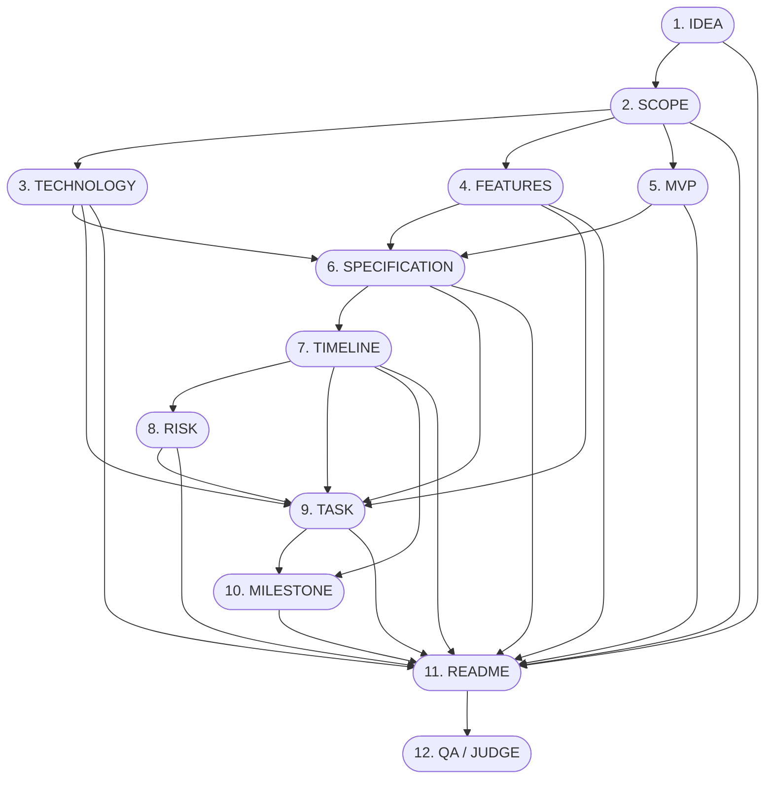

# Gate 09 Unit 3 Analysis
## 12 AI Agents & Tool Bindings — Architectural Implementation Plan

**Document ID:** `GF-GATE09-UNIT3-ANALYSIS`  
**Status:** ANALYSIS ONLY — AWAITING REVIEW  
**Date:** 2026-09-20  
**Workspace:** `d:\PROJECTS\Infosys SpringBoot\growflow_ai`  
**Branch:** `gate-09/ai-blueprint`  
**Target Unit:** Gate 09 — Unit 3: 12 AI Agents & Tool Bindings  

---

## 1. Status & Scope

### 1.1 Analysis-Only Mode Statement
This document constitutes the formal, file-level architectural analysis and implementation plan for **Gate 09 — Unit 3: 12 AI Agents & Tool Bindings**. 

In strict adherence to the analysis-only mandate:
- **NO** production code has been modified or implemented.
- **NO** tests have been modified or executed.
- **NO** database schemas or migrations have been created.
- **NO** LangGraph orchestration or durable execution workers have been introduced.
- **NO** Server-Sent Events (SSE) or frontend integration code has been altered.
- **NO** changes have been made to `BlueprintService`.
- **NO** git commits, pushes, or PRs have been initiated.
- Exactly one file is created in this run: `docs/gate09_unit3_analysis.md`.

### 1.2 Unit 3 Objectives
Unit 3 will deliver the real Python implementations of the 12 AI agents that synthesize the GrowFlow project blueprint. These agents will:
1. Replace legacy mock scaffolding with real AI reasoning pipelines.
2. Consume the typed, tenant-isolated context models delivered in Unit 2 (`ProjectBaseContext`, `AssessmentContext`, and agent projections).
3. Construct hardened, version-controlled prompts enforcing domain constraints.
4. Execute structured synthesis exclusively through the centralized Unit 1 `AIProviderGateway`.
5. Return validated Pydantic v2 output models conforming to the Unit 2 agent contracts.
6. Assemble standardized `AgentExecutionProvenance` metadata capturing token usage, model identifiers, latency, and key aliases.
7. Provide deterministic unit test coverage utilizing the zero-network mock provider adapter.

---

## 2. Authoritative References

This analysis is strictly grounded in the following frozen architectural specifications and evidence records:
1. **GrowFlow Part 6F — AI Agent Architecture & Orchestration (FINAL):** Frozen agent responsibilities (§4.1–§4.12), canonical graph (§8), dependency rules (§9), context isolation (§15–§17, §90), and QA scorecard rules (§30–§35).
2. **GrowFlow Part 6E — AI Provider Gateway & Model Architecture (FINAL):** Centralized gateway boundary (§6), five-key OpenRouter pool (§10–§14), capability policy (§16), non-downgrade fallback (§18), and structured contracts (§44).
3. **GrowFlow Part 6G — RAG Knowledge & Document Intelligence Architecture (FINAL):** Knowledge retrieval boundaries, student/mentor scoping, and deferred vector integration status.
4. **Gate 09 Specification Resolution (`docs/gate09_spec_resolution.md`):** Frozen architectural decisions A1 (serial `TASK → MILESTONE` graph), A2 (single canonical blueprint + `generation_number`), A3 (QA pass criteria $\ge 75$ + 0 critical, max 2 auto-regens), A4 (non-downgrade model capability policy), and A5 (two-phase cancellation).
5. **Gate 09 Unit 1 Analysis (`docs/gate09_unit1_analysis.md`) & Evidence (`docs/implementation/GATE_09_UNIT_1_EVIDENCE.md`):** Verified centralized gateway, capability models, and test results.
6. **Gate 09 Unit 2 Analysis (`docs/gate09_unit2_analysis.md`) & Evidence (`docs/implementation/GATE_09_UNIT_2_EVIDENCE.md`):** Verified base contracts, 11 generator agent contracts, QA contract, workflow state, and `ProjectContextBuilder`.

---

## 3. Current Repository Audit

A thorough audit of the actual workspace files was conducted. The findings for every relevant existing component are categorized below:

| File Path | Current Purpose | Unit 3 Action | Rationale |
|---|---|---|---|
| `backend/app/infrastructure/ai/gateway.py` | Centralized `AIProviderGateway` managing key pool, retries, fallback, and `execute_structured`. | **REUSE** | Unit 3 agents invoke `gateway.execute_structured(...)`. Zero gateway modifications required. |
| `backend/app/infrastructure/ai/models.py` | Defines `ProviderCapability`, `AIExecutionResult`, `AIGenerationRequest`, `AIErrorCategory`, and exceptions. | **REUSE** | Defines the operational contracts returned to agents. |
| `backend/app/infrastructure/ai/policy.py` | Enforces capability-to-model mapping and non-downgrade fallback hierarchy. | **REUSE** | Resolves primary and fallback models per agent capability. |
| `backend/app/infrastructure/ai/key_pool.py` | In-memory health state machine across 5 OpenRouter keys. | **REUSE** | Manages key health and rotation under the gateway. |
| `backend/app/infrastructure/ai/adapters/base.py` | Abstract `AIProviderAdapter` transport interface. | **REUSE** | Core adapter contract. |
| `backend/app/infrastructure/ai/adapters/openrouter.py` | HTTP transport client with JSON schema injection and backoff. | **REUSE** | Production provider transport. |
| `backend/app/infrastructure/ai/adapters/mock.py` | Deterministic in-memory mock adapter for zero-network testing. | **REUSE** | Unit 3 test suite will use mock adapter with canned/fixture data. |
| `backend/app/domain/ai/contracts/base.py` | `BaseAgentInput`, `BaseAgentOutput`, and `AgentExecutionProvenance`. | **REUSE** | Contract foundations for all agent inputs, outputs, and telemetry. |
| `backend/app/domain/ai/contracts/agents.py` | Typed contracts for 11 generator agents (Idea through README) with validators. | **REUSE** | Authoritative structured output schemas and input contexts. |
| `backend/app/domain/ai/contracts/qa.py` | `QAJudgeAgentInput`, `QAJudgeAgentOutput`, `QAFinding`, and $\ge 75$ + 0 critical validator. | **REUSE** | Authoritative contract for the QA / Judge agent. |
| `backend/app/domain/ai/contracts/state.py` | `BlueprintWorkflowState` and `BlueprintWorkflowStateModel`. | **REUSE** | Shared workflow state used in tests and future Unit 4 LangGraph nodes. |
| `backend/app/domain/ai/context/models.py` | `ProjectBaseContext`, `AssessmentContext`, and 12 agent projections. | **REUSE** | Supplies tenant-isolated context into agent inputs. |
| `backend/app/domain/ai/context/builder.py` | `ProjectContextBuilder` service assembling authorized project/assessment data. | **REUSE** | Authorizes and projects context for agent inputs. |
| `backend/app/application/services/blueprint_service.py` | Legacy monolithic blueprint coordinator with hardcoded scaffolds and mock QA. | **LEAVE UNTOUCHED** | Frozen boundary. Replacing/wiring `BlueprintService` into LangGraph belongs to Unit 4. |
| `backend/app/domain/blueprint/models.py` | `BlueprintStatus`, `BlueprintQAStatus`, `BlueprintSectionKey`. | **REUSE** | Domain enums referenced by QA and state models. |
| `backend/app/infrastructure/database/models/blueprint.py` | SQLAlchemy ORM models `BlueprintModel` and `BlueprintJobModel`. | **LEAVE UNTOUCHED** | DB persistence is out of scope for Unit 3. |
| `backend/app/infrastructure/repositories/project_repository.py` | Project instance and profile data access. | **LEAVE UNTOUCHED** | Consumed via `ProjectContextBuilder`. Agents never access directly. |
| `backend/app/infrastructure/repositories/assessment_repository.py` | Assessment session, answer, and EPU result data access. | **LEAVE UNTOUCHED** | Consumed via `ProjectContextBuilder`. Agents never access directly. |
| `backend/app/config/settings.py` | Application settings (`AISettings`, `TavilySettings`). | **REUSE** | Contains AI model configurations, timeouts, and key aliases. |
| `backend/tests/unit/test_ai_gateway.py` | Gateway unit tests (21 tests). | **LEAVE UNTOUCHED** | Gateway regression baseline. |
| `backend/tests/unit/test_agent_contracts.py` | Unit 2 contract validation tests (12 tests). | **LEAVE UNTOUCHED** | Contract regression baseline. |
| `backend/tests/unit/test_qa_contract.py` | Unit 2 QA scorecard validation tests (9 tests). | **LEAVE UNTOUCHED** | QA contract regression baseline. |
| `backend/tests/unit/test_context_builder.py` | Unit 2 context builder tests (7 tests). | **LEAVE UNTOUCHED** | Context builder regression baseline. |
| `backend/tests/unit/test_project_isolation.py` | Unit 2 multi-tenant isolation tests (5 tests). | **LEAVE UNTOUCHED** | Security regression baseline. |

---

## 4. Unit 1 Gateway Audit

Inspection of `backend/app/infrastructure/ai/gateway.py`, `models.py`, and `policy.py` confirms exact operational parameters:

1. **Gateway Class:** `AIProviderGateway` (located in `backend.app.infrastructure.ai.gateway`).
2. **Request Model:** `AIGenerationRequest` (contains `prompt`, `system_prompt`, `capability`, `model`, `temperature`, `max_tokens`, `timeout_seconds`, `correlation_id`, `execution_id`).
3. **Execution Result Model:** `AIExecutionResult[T]` (contains `content: T | str`, `raw_text: str`, `provider: str`, `model: str`, `capability: ProviderCapability`, `key_alias: str`, `latency_ms: float`, `usage: AIUsageMetadata | None`, `retry_count: int`, `correlation_id: str | None`, `execution_id: str | None`).
4. **Capability Enum:** `ProviderCapability` (`FAST`, `STANDARD`, `REASONING`, `EMBEDDING`).
5. **Model Policy:** `AIModelPolicy` resolves primary models and enforces non-downgrade fallback:
   $$\text{REASONING} \ge \text{STANDARD} \ge \text{FAST}$$
   An attempt to downgrade from `REASONING` to `STANDARD` raises `AICapabilityDowngradeException`.
6. **Structured Output Signature:**
   ```python
   async def execute_structured(
       self,
       schema: type[T],
       prompt: str,
       system_prompt: str = "You are the GrowFlow Architectural Intelligence Engine.",
       capability: ProviderCapability = ProviderCapability.STANDARD,
       model: str | None = None,
       temperature: float = 0.2,
       max_tokens: int = 4000,
       timeout_seconds: float | None = None,
       correlation_id: str | None = None,
       execution_id: str | None = None,
   ) -> AIExecutionResult[T]:
   ```
7. **Mock Provider Behavior:** `MockAIProviderAdapter` provides deterministic mock text and structured responses. It supports explicit canned responses via `register_structured_response(schema_name, response_data)` and a fallback schema synthesizer.
8. **Failure Behavior:** Gateway catches `ProviderError` and classifies into `RATE_LIMITED` (rotates key), `TRANSIENT_SERVER` / `TIMEOUT` (retries key up to max retries with exponential backoff), `AUTH_ERROR` (marks key failed and rotates), or `NON_RETRYABLE` (raises `AIException`).
9. **Usage & Provenance Fields:** Returns exact token counts (`prompt_tokens`, `completion_tokens`, `total_tokens`), `latency_ms`, `key_alias` (e.g. `key_1`), `model`, and `retry_count`.
10. **Correlation & Execution IDs:** Passed explicitly in method arguments or extracted from `get_correlation_id()`, preserved across logging and execution results.
11. **Streaming Status:** Streaming is not utilized for structured generation. Batch structured completion is used; real-time progress streaming is handled via SSE events emitted at workflow node boundaries.
12. **Agent Readiness:** The gateway fully supports all 12 agents. Calling `gateway.execute_structured(schema=TargetOutputModel, ...)` directly yields validated Pydantic instances.

---

## 5. Unit 2 Contract Audit

Every agent contract delivered in Unit 2 was audited against the reasoning requirements of the 12 real agents:

| Agent | Input Contract | Output Contract | Key Invariants / Validation Rules | Contract Gaps |
|---|---|---|---|---|
| **Idea** | `IdeaAgentInput` | `IdeaAgentOutput` | `target_users` (min 1), `value_propositions` (min 2), non-empty title/vision/problem/solution. | None |
| **Scope** | `ScopeAgentInput` | `ScopeAgentOutput` | `in_scope` (min 3), `out_of_scope` (min 2), `architectural_boundaries` (min 2), `technical_constraints` (min 1). | None |
| **Technology** | `TechnologyAgentInput` | `TechnologyAgentOutput` | `backend`, `database`, `frontend`, `security_auth`, `telemetry_observability` (TechItem), `communication_protocols` (min 1). | None |
| **Features** | `FeaturesAgentInput` | `FeaturesAgentOutput` | `features` (min 4 FeatureItems), regex `^F\d{2}$`, unique IDs, at least 2 P0 features. | None |
| **MVP** | `MVPAgentInput` | `MVPAgentOutput` | `core_user_journey` (min 3), `included_capabilities` (min 2), `excluded_from_mvp` (min 1), `validation_criteria` (min 2). | None |
| **Specification** | `SpecificationAgentInput` | `SpecificationAgentOutput` | `entities` (min 2 DataEntitySpec), `api_endpoints` (min 3 APIEndpointSpec), `system_acceptance_criteria` (min 2). | None |
| **Timeline** | `TimelineAgentInput` | `TimelineAgentOutput` | `phases` (min 3 TimelinePhase), duration sum must equal `estimated_total_weeks`. | None |
| **Risk** | `RiskAgentInput` | `RiskAgentOutput` | `risks` (min 4 RiskItems), regex `^R\d{2}$`, unique IDs, must include both `TECHNICAL` and `SECURITY` risks. | None |
| **Task** | `TaskAgentInput` | `TaskAgentOutput` | `tasks` (min 8 TaskItems), regex `^T\d{2}$`, unique IDs, positive `estimated_hours`. | None |
| **Milestone** | `MilestoneAgentInput` | `MilestoneAgentOutput` | `milestones` (min 3 MilestoneItems), regex `^M\d{1,2}$`, unique IDs, valid `GateDecision`. | None |
| **README** | `ReadmeAgentInput` | `ReadmeAgentOutput` | `getting_started` (min 2 steps), `tech_stack_summary`, `contributing_guidelines`. | None |
| **QA / Judge** | `QAJudgeAgentInput` | `QAJudgeAgentOutput` | Score $0..100$; PASS requires score $\ge 75$ AND 0 `CRITICAL` findings; failure requires regeneration target or human review. | None |

**Audit Verdict:** All contracts are comprehensive, strongly typed, and frozen. No contract gaps exist.

---

## 6. Existing BlueprintService Audit

An inspection of `backend/app/application/services/blueprint_service.py` was conducted:
1. **Current Operations:** Manages the legacy lifecycle of blueprints. It runs generation in background asyncio tasks (`_run_generation_task`), assembles raw project context (`_assemble_project_context`), generates hardcoded mock dictionaries sequentially (`_synthesize_section`), runs a local rule-based scorecard check (`_evaluate_qa_judge`), saves JSON blobs directly to `blueprints.content`, and emits outbox events (`BLUEPRINT_GENERATED`, `BLUEPRINT_APPROVED`).
2. **Hardcoded Aspects:**
   - 10 hardcoded dictionaries in `_synthesize_section` with static text for agriculture drones.
   - Hardcoded weights: `section_weights = [(PROJECT_PROFILE, 10), ..., (README, 95)]`.
   - Hardcoded rule checks in `_evaluate_qa_judge` scoring 84 points.
3. **What Unit 3 Replaces Eventually:** The real agents built in Unit 3 will replace the synthetic mock dictionaries.
4. **Unit 3 Treatment:** `BlueprintService` **MUST REMAIN COMPLETELY UNTOUCHED** during Unit 3.
5. **Conflict Analysis:** Existing service contracts do not conflict with the agent implementations because Unit 3 agents are domain-layer components (`backend/app/domain/ai/agents/`), completely isolated from the current application service layer until Unit 4 wires them via LangGraph.

---

## 7. Frozen 12-Agent Graph

The authoritative graph from Part 6F §8 and Gate 09 Decision A1 is architecturally frozen:



### Critical Dependency Rules
1. **Fan-Out Parallelism:** `Technology`, `Features`, and `MVP` are logically parallel; each consumes only `ScopeAgentOutput` and scoped project context.
2. **Fan-In Synchronization:** `Specification` synchronizes `Technology`, `Features`, and `MVP`.
3. **Timeline Precedes Risk:** `Timeline` generates phase durations based on `Specification` and project complexity. It does **not** and cannot depend on `RiskAgentOutput`.
4. **Strict Serial Task $\to$ Milestone:** `Milestone` groups tasks and references task IDs (`T01`, `T02`, etc.) and hours. `Milestone` cannot execute before `Task`.
5. **QA / Judge Evaluates All Outputs:** QA receives all synthesized sections, verified against project and assessment context.

---

## 8. Agent-by-Agent Analysis

### 8.1 Idea Agent
1. **Purpose:** Transforms raw student problem/solution statements and assessment readiness context into a rigorous project vision, domain boundary, and value proposition.
2. **Exact Input:** `IdeaAgentInput` (`project_name`, `initial_problem`, `initial_solution`, `complexity_preference`, `student_skill_level`, `assessment_readiness_tier`, `assessment_recommendations`).
3. **Exact Output:** `IdeaAgentOutput` (`refined_title`, `vision_statement`, `problem_statement`, `proposed_solution`, `target_users`, `value_propositions`, `core_domain`, `summary`, `confidence_score`, `assumptions`, `warnings`).
4. **Required Upstream Outputs:** None (root generator node).
5. **Required Project Context:** `IdeaAgentContext` (from `ProjectContextBuilder.build_idea_context`).
6. **Required Assessment Context:** Assessment readiness tier, skill level, and recommendations.
7. **Required External Knowledge:** None.
8. **Required Tools:** None.
9. **Tool Classification:** N/A.
10. **Prompt Responsibilities:** Elevate casual student language into an architectural project premise; align technical scope with student skill tier; forbid implementation-specific framework lock-in at this stage.
11. **Structured Output Strategy:** `gateway.execute_structured(schema=IdeaAgentOutput, ...)`.
12. **Provider Capability:** `ProviderCapability.STANDARD`.
13. **Expected Model Behavior:** Synthesize clear domain boundaries, avoiding bloated corporate jargon.
14. **Validation Responsibilities:** Enforce `min_length` on `target_users` ($\ge 1$) and `value_propositions` ($\ge 2$).
15. **Failure Modes:** Generic/vague problem statements; refusal due to safety; JSON parse error.
16. **Regeneration Implications:** If QA flags domain ambiguity, regenerate with `qa_feedback_hint`.
17. **Provenance Requirements:** Standard `AgentExecutionProvenance`.
18. **Security/Isolation:** Scoped strictly to caller's project context.
19. **Test Strategy:** Unit test with mock provider; verify Pydantic validation on valid and malformed outputs.
20. **Implementation Files:** `backend/app/domain/ai/agents/idea.py`, `backend/app/domain/ai/prompts/idea.py`.

---

### 8.2 Scope Agent
1. **Purpose:** Establishes rigid functional boundaries, explicit out-of-scope exclusions, architectural boundaries, and constraints based on the refined Idea and student assessment gaps.
2. **Exact Input:** `ScopeAgentInput` (`idea: IdeaAgentOutput`, `assessment_gaps: list[str]`).
3. **Exact Output:** `ScopeAgentOutput` (`in_scope`, `out_of_scope`, `architectural_boundaries`, `technical_constraints`, `deliverable_outcomes`).
4. **Required Upstream Outputs:** `IdeaAgentOutput`.
5. **Required Project Context:** Profile constraints, profile assumptions.
6. **Required Assessment Context:** `identified_gaps` from assessment EPU.
7. **Required External Knowledge:** None.
8. **Required Tools:** None.
9. **Tool Classification:** N/A.
10. **Prompt Responsibilities:** Prevent scope creep; translate assessment gaps into technical constraints (e.g. if student lacks distributed systems knowledge, constrain scope to modular monolith).
11. **Structured Output Strategy:** `gateway.execute_structured(schema=ScopeAgentOutput, ...)`.
12. **Provider Capability:** `ProviderCapability.STANDARD`.
13. **Expected Model Behavior:** Concrete deliverables and unambiguous non-goals.
14. **Validation Responsibilities:** Enforce list lengths: `in_scope` $\ge 3$, `out_of_scope` $\ge 2$, `architectural_boundaries` $\ge 2$, `technical_constraints` $\ge 1$.
15. **Failure Modes:** Overly broad boundaries; contradictory in/out-of-scope items.
16. **Regeneration Implications:** Target if downstream agents produce features outside scope.
17. **Provenance Requirements:** Standard `AgentExecutionProvenance`.
18. **Security/Isolation:** Receives filtered assessment gaps, no raw student PII.
19. **Test Strategy:** Mock provider validation of boundary constraints.
20. **Implementation Files:** `backend/app/domain/ai/agents/scope.py`, `backend/app/domain/ai/prompts/scope.py`.

---

### 8.3 Technology Agent
1. **Purpose:** Recommends a cohesive, production-grade technology stack (backend, database, frontend, auth, observability) with educational learning curve rationales matching student skill level.
2. **Exact Input:** `TechnologyAgentInput` (`idea: IdeaAgentOutput`, `scope: ScopeAgentOutput`, `student_skill_level: str`, `preferred_technologies: list[str]`).
3. **Exact Output:** `TechnologyAgentOutput` (`backend`, `database`, `frontend`, `communication_protocols`, `security_auth`, `telemetry_observability`, `third_party_services`, `justification_matrix`).
4. **Required Upstream Outputs:** `IdeaAgentOutput`, `ScopeAgentOutput`.
5. **Required Project Context:** Student's preferred technologies (from project creation).
6. **Required Assessment Context:** Student skill level (`BEGINNER`, `INTERMEDIATE`, `ADVANCED`).
7. **Required External Knowledge:** None (in Unit 3).
8. **Required Tools:** None.
9. **Tool Classification:** N/A.
10. **Prompt Responsibilities:** Enforce modern, industry-standard stacks; balance student preferences against architectural fit; justify learning curves.
11. **Structured Output Strategy:** `gateway.execute_structured(schema=TechnologyAgentOutput, ...)`.
12. **Provider Capability:** `ProviderCapability.STANDARD`.
13. **Expected Model Behavior:** Select interoperable frameworks (e.g., FastAPI + PostgreSQL + React).
14. **Validation Responsibilities:** Ensure all required categories have valid `TechItem` structures.
15. **Failure Modes:** Recommending deprecated or incompatible libraries; ignoring student skill tier.
16. **Regeneration Implications:** Target if QA detects stack incompatibility or excessive complexity.
17. **Provenance Requirements:** Standard `AgentExecutionProvenance`.
18. **Security/Isolation:** Scoped to project.
19. **Test Strategy:** Verify stack selection consistency with skill levels.
20. **Implementation Files:** `backend/app/domain/ai/agents/technology.py`, `backend/app/domain/ai/prompts/technology.py`.

---

### 8.4 Features Agent
1. **Purpose:** Decomposes the scoped problem into discrete, prioritized user features classified into P0, P1, and P2 tiers with explicit user stories and dependencies.
2. **Exact Input:** `FeaturesAgentInput` (`idea: IdeaAgentOutput`, `scope: ScopeAgentOutput`).
3. **Exact Output:** `FeaturesAgentOutput` (`features: list[FeatureItem]`).
4. **Required Upstream Outputs:** `IdeaAgentOutput`, `ScopeAgentOutput`.
5. **Required Project Context:** Target users, profile objective.
6. **Required Assessment Context:** None directly (handled via Scope).
7. **Required External Knowledge:** None.
8. **Required Tools:** None.
9. **Tool Classification:** N/A.
10. **Prompt Responsibilities:** Restrict features strictly to in-scope deliverables; assign deterministic IDs (`F01`, `F02`, etc.); construct standard user stories.
11. **Structured Output Strategy:** `gateway.execute_structured(schema=FeaturesAgentOutput, ...)`.
12. **Provider Capability:** `ProviderCapability.STANDARD`.
13. **Expected Model Behavior:** High-cohesion, low-coupling feature definitions.
14. **Validation Responsibilities:** Model validator enforces: $\ge 4$ features, unique IDs matching `^F\d{2}$`, and at least two P0 features.
15. **Failure Modes:** Generating features outside scope boundaries; duplicate feature IDs; insufficient P0 features.
16. **Regeneration Implications:** Target if QA identifies scope creep or missing foundational capabilities.
17. **Provenance Requirements:** Standard `AgentExecutionProvenance`.
18. **Security/Isolation:** Pure project domain context.
19. **Test Strategy:** Unit test feature ID validator and P0 distribution enforcement.
20. **Implementation Files:** `backend/app/domain/ai/agents/features.py`, `backend/app/domain/ai/prompts/features.py`.

---

### 8.5 MVP Agent
1. **Purpose:** Defines the minimal viable product boundary, Stage-1 core user journey, validation criteria, and what is deliberately deferred from the initial deployment.
2. **Exact Input:** `MVPAgentInput` (`idea: IdeaAgentOutput`, `scope: ScopeAgentOutput`, `research_evidence: list[ResearchSource]`).
3. **Exact Output:** `MVPAgentOutput` (`mvp_name`, `core_user_journey`, `included_capabilities`, `excluded_from_mvp`, `validation_criteria`, `minimum_viable_architecture`).
4. **Required Upstream Outputs:** `IdeaAgentOutput`, `ScopeAgentOutput`.
5. **Required Project Context:** Complexity preference.
6. **Required Assessment Context:** Skill level.
7. **Required External Knowledge:** Optional `ResearchSource` web evidence (empty in Unit 3; see Section 13).
8. **Required Tools:** None in Unit 3 (Tavily integration deferred).
9. **Tool Classification:** N/A.
10. **Prompt Responsibilities:** Ruthlessly trim non-essential features; formulate an end-to-end walking skeleton user journey.
11. **Structured Output Strategy:** `gateway.execute_structured(schema=MVPAgentOutput, capability=ProviderCapability.REASONING, ...)`.
12. **Provider Capability:** `ProviderCapability.REASONING` (Part 6E §18, Gate 09 Spec Resolution).
13. **Expected Model Behavior:** High reasoning depth to balance feasibility against core product value.
14. **Validation Responsibilities:** Min lengths on `core_user_journey` ($\ge 3$), `included_capabilities` ($\ge 2$), `excluded_from_mvp` ($\ge 1$), `validation_criteria` ($\ge 2$).
15. **Failure Modes:** Over-scoped MVP; vague validation criteria.
16. **Regeneration Implications:** Target if QA determines MVP architecture is unrealistic for beginner.
17. **Provenance Requirements:** Standard `AgentExecutionProvenance` capturing `REASONING` model.
18. **Security/Isolation:** Scoped to project.
19. **Test Strategy:** Mock provider testing with `REASONING` capability.
20. **Implementation Files:** `backend/app/domain/ai/agents/mvp.py`, `backend/app/domain/ai/prompts/mvp.py`.

---

### 8.6 Specification Agent
1. **Purpose:** Synchronizes Technology, Features, and MVP to produce formal data entity schemas, REST API endpoint contracts, integration flows, and acceptance criteria.
2. **Exact Input:** `SpecificationAgentInput` (`idea`, `scope`, `technology`, `features`, `mvp`).
3. **Exact Output:** `SpecificationAgentOutput` (`entities`, `api_endpoints`, `integration_flows`, `system_acceptance_criteria`).
4. **Required Upstream Outputs:** `Idea`, `Scope`, `Technology`, `Features`, `MVP`.
5. **Required Project Context:** Project name, complexity.
6. **Required Assessment Context:** Indirectly via upstream models.
7. **Required External Knowledge:** None.
8. **Required Tools:** None.
9. **Tool Classification:** N/A.
10. **Prompt Responsibilities:** Maintain strict 1:1 traceability between features and API endpoints; ensure data entities reflect selected database technology (e.g. relational foreign keys for PostgreSQL).
11. **Structured Output Strategy:** `gateway.execute_structured(schema=SpecificationAgentOutput, ...)`.
12. **Provider Capability:** `ProviderCapability.STANDARD`.
13. **Expected Model Behavior:** Synthesize RESTful paths (`/api/v1/...`), valid HTTP verbs, and field data types.
14. **Validation Responsibilities:** Enforce $\ge 2$ entities, $\ge 3$ API endpoints, and $\ge 2$ system acceptance criteria.
15. **Failure Modes:** Endpoint path syntax errors; missing auth flags; orphan entities.
16. **Regeneration Implications:** Target if Task Agent cannot break down endpoints or QA detects schema flaws.
17. **Provenance Requirements:** Standard `AgentExecutionProvenance`.
18. **Security/Isolation:** Scoped to project.
19. **Test Strategy:** Verify entity and endpoint schema validation with mock provider.
20. **Implementation Files:** `backend/app/domain/ai/agents/specification.py`, `backend/app/domain/ai/prompts/specification.py`.

---

### 8.7 Timeline Agent
1. **Purpose:** Synthesizes an end-to-end phased implementation schedule, calculates duration in weeks, and determines the critical path.
2. **Exact Input:** `TimelineAgentInput` (`idea`, `specification`, `complexity`, `project_deadline_weeks`).
3. **Exact Output:** `TimelineAgentOutput` (`estimated_total_weeks`, `phases: list[TimelinePhase]`, `critical_path_summary`).
4. **Required Upstream Outputs:** `IdeaAgentOutput`, `SpecificationAgentOutput`. (Note: Does **not** depend on Risk output; frozen graph places Timeline before Risk).
5. **Required Project Context:** Complexity preference, target deadline weeks.
6. **Required Assessment Context:** Student skill level (from Idea).
7. **Required External Knowledge:** None.
8. **Required Tools:** None.
9. **Tool Classification:** N/A.
10. **Prompt Responsibilities:** Construct sequential and overlapping phases; align total duration with project deadline; identify critical path bottlenecks.
11. **Structured Output Strategy:** `gateway.execute_structured(schema=TimelineAgentOutput, ...)`.
12. **Provider Capability:** `ProviderCapability.STANDARD`.
13. **Expected Model Behavior:** Produce realistic durations matching student velocity.
14. **Validation Responsibilities:** Cross-field validator enforces:
    $$\sum \text{phase.duration\_weeks} == \text{estimated\_total\_weeks}$$
15. **Failure Modes:** Math discrepancy between phase durations and total weeks; unrealistic duration for beginner.
16. **Regeneration Implications:** Target if phase sum fails or QA detects schedule infeasibility.
17. **Provenance Requirements:** Standard `AgentExecutionProvenance`.
18. **Security/Isolation:** Scoped to project.
19. **Test Strategy:** Verify phase sum validation rejects inconsistent durations.
20. **Implementation Files:** `backend/app/domain/ai/agents/timeline.py`, `backend/app/domain/ai/prompts/timeline.py`.

---

### 8.8 Risk Agent
1. **Purpose:** Identifies technical, security, operational, and schedule risks, rating severity and likelihood and defining concrete mitigation strategies and fallback plans.
2. **Exact Input:** `RiskAgentInput` (`technology`, `features`, `specification`, `timeline`).
3. **Exact Output:** `RiskAgentOutput` (`risks: list[RiskItem]`).
4. **Required Upstream Outputs:** `Technology`, `Features`, `Specification`, `Timeline`.
5. **Required Project Context:** Identified assessment gaps.
6. **Required Assessment Context:** Technical confidence score and gaps.
7. **Required External Knowledge:** None.
8. **Required Tools:** None.
9. **Tool Classification:** N/A.
10. **Prompt Responsibilities:** Identify real architectural vulnerabilities and student failure modes; enforce deterministic IDs (`R01`, `R02`, etc.); mandate both technical and security risks.
11. **Structured Output Strategy:** `gateway.execute_structured(schema=RiskAgentOutput, ...)`.
12. **Provider Capability:** `ProviderCapability.STANDARD`.
13. **Expected Model Behavior:** Context-specific risk analysis (e.g. rate limits on third-party APIs, JWT token expiry).
14. **Validation Responsibilities:** Model validator enforces $\ge 4$ risks, unique IDs matching `^R\d{2}$`, and at least one `TECHNICAL` and one `SECURITY` risk.
15. **Failure Modes:** Omitting security risks; generic boilerplate mitigations; duplicate IDs.
16. **Regeneration Implications:** Target if QA flags unmitigated security gaps.
17. **Provenance Requirements:** Standard `AgentExecutionProvenance`.
18. **Security/Isolation:** Scoped to project.
19. **Test Strategy:** Verify risk category and ID uniqueness validators.
20. **Implementation Files:** `backend/app/domain/ai/agents/risk.py`, `backend/app/domain/ai/prompts/risk.py`.

---

### 8.9 Task Agent
1. **Purpose:** Breaks down the technical specification, features, timeline, and risk mitigations into granular, actionable work items with hour estimates, categories, and dependencies.
2. **Exact Input:** `TaskAgentInput` (`specification`, `technology`, `features`, `timeline`, `risks`).
3. **Exact Output:** `TaskAgentOutput` (`tasks: list[TaskItem]`).
4. **Required Upstream Outputs:** `Specification`, `Technology`, `Features`, `Timeline`, `Risks`.
5. **Required Project Context:** Complexity.
6. **Required Assessment Context:** Indirectly via upstream models.
7. **Required External Knowledge:** None.
8. **Required Tools:** None.
9. **Tool Classification:** N/A.
10. **Prompt Responsibilities:** Generate discrete 2–16 hour tasks; link tasks to feature IDs where applicable; cover all layers (`SETUP`, `DATABASE`, `BACKEND`, `FRONTEND`, `INTEGRATION`, `TESTING`, `DEPLOYMENT`); enforce IDs `T01`, `T02`, etc.
11. **Structured Output Strategy:** `gateway.execute_structured(schema=TaskAgentOutput, ...)`.
12. **Provider Capability:** `ProviderCapability.STANDARD`.
13. **Expected Model Behavior:** Logical sequence of actionable engineering tasks.
14. **Validation Responsibilities:** Model validator enforces $\ge 8$ tasks, unique IDs matching `^T\d{2}$`, and positive `estimated_hours`.
15. **Failure Modes:** Excessive task size (>40h); cyclic dependencies; missing foundational setup tasks.
16. **Regeneration Implications:** Target if Milestone Agent cannot group tasks or QA detects missing testing tasks.
17. **Provenance Requirements:** Standard `AgentExecutionProvenance`.
18. **Security/Isolation:** Scoped to project.
19. **Test Strategy:** Unit test task breakdown validation and unique ID checks.
20. **Implementation Files:** `backend/app/domain/ai/agents/task.py`, `backend/app/domain/ai/prompts/task.py`.

---

### 8.10 Milestone Agent
1. **Purpose:** Groups tasks into major stage gate deliverables, defining target completion weeks, verification criteria, and gate decisions (`GATE_1_FOUNDATION`, `GATE_2_CORE_MVP`, `GATE_3_POLISH_HANDOFF`).
2. **Exact Input:** `MilestoneAgentInput` (`timeline: TimelineAgentOutput`, `tasks: TaskAgentOutput`).
3. **Exact Output:** `MilestoneAgentOutput` (`milestones: list[MilestoneItem]`).
4. **Required Upstream Outputs:** `TimelineAgentOutput`, `TaskAgentOutput` (strictly serial after Task).
5. **Required Project Context:** Project name.
6. **Required Assessment Context:** Indirectly via Timeline.
7. **Required External Knowledge:** None.
8. **Required Tools:** None.
9. **Tool Classification:** N/A.
10. **Prompt Responsibilities:** Map tasks into coherent release stages; ensure milestone target weeks fall within total timeline duration; define testable gate criteria; assign IDs `M1`, `M2`, etc.
11. **Structured Output Strategy:** `gateway.execute_structured(schema=MilestoneAgentOutput, ...)`.
12. **Provider Capability:** `ProviderCapability.STANDARD`.
13. **Expected Model Behavior:** Clear stage-gate definitions with concrete verifiable artifacts.
14. **Validation Responsibilities:** Model validator enforces $\ge 3$ milestones, unique IDs matching `^M\d{1,2}$`, and valid `GateDecision`.
15. **Failure Modes:** Referencing non-existent task IDs; scheduling milestones past project end date.
16. **Regeneration Implications:** Target if QA flags unmapped tasks or unrealistic stage gates.
17. **Provenance Requirements:** Standard `AgentExecutionProvenance`.
18. **Security/Isolation:** Scoped to project.
19. **Test Strategy:** Verify milestone uniqueness and task association validation.
20. **Implementation Files:** `backend/app/domain/ai/agents/milestone.py`, `backend/app/domain/ai/prompts/milestone.py`.

---

### 8.11 README Agent
1. **Purpose:** Consumes all upstream validated outputs to synthesize a comprehensive, professional project repository README, architecture overview, setup guide, and environment configuration spec.
2. **Exact Input:** `ReadmeAgentInput` (`curated_context: ReadmeCuratedContext` bundling Idea, Scope, Technology, Features, MVP, Timeline, Risks, Tasks, Milestones).
3. **Exact Output:** `ReadmeAgentOutput` (`project_title`, `project_tagline`, `overview`, `architecture_overview`, `tech_stack_summary`, `getting_started`, `environment_variables`, `contributing_guidelines`).
4. **Required Upstream Outputs:** Curated context from all 10 preceding generator agents.
5. **Required Project Context:** Project name.
6. **Required Assessment Context:** None (consumes only validated architectural decisions).
7. **Required External Knowledge:** None.
8. **Required Tools:** None.
9. **Tool Classification:** N/A.
10. **Prompt Responsibilities:** Harmonize all technical decisions into a cohesive developer guide; extract required environment variables; structure clean local setup steps.
11. **Structured Output Strategy:** `gateway.execute_structured(schema=ReadmeAgentOutput, ...)`.
12. **Provider Capability:** `ProviderCapability.STANDARD`.
13. **Expected Model Behavior:** Synthesize clear developer onboarding documentation.
14. **Validation Responsibilities:** Min length on `getting_started` ($\ge 2$ steps), valid `EnvVarSpec` list.
15. **Failure Modes:** Contradicting earlier technology choices (e.g. referencing MongoDB when PostgreSQL was chosen); missing core setup steps.
16. **Regeneration Implications:** Target if QA detects documentation contradictions.
17. **Provenance Requirements:** Standard `AgentExecutionProvenance`.
18. **Security/Isolation:** Never includes real credentials or secret values in default env vars.
19. **Test Strategy:** Mock provider validation of setup guide and environment variable schema.
20. **Implementation Files:** `backend/app/domain/ai/agents/readme.py`, `backend/app/domain/ai/prompts/readme.py`.

---

### 8.12 QA / Judge Agent
1. **Purpose:** Evaluates the complete set of synthesized blueprint sections against the project problem, assessment EPU, and internal consistency rules, producing a quality scorecard, itemized findings, gate verdict, and targeted regeneration targets.
2. **Exact Input:** `QAJudgeAgentInput` (`all_agent_outputs: dict[str, Any]`, `project_context: ProjectBaseContext`, `assessment_context: AssessmentContext`).
3. **Exact Output:** `QAJudgeAgentOutput` (`status: BlueprintQAStatus`, `overall_score: int`, `evaluated_criteria: dict[str, int]`, `findings: list[QAFinding]`, `recommendations: list[str]`, `regeneration_target: str | None`, `requires_human_review: bool`).
4. **Required Upstream Outputs:** All 11 generator agent outputs.
5. **Required Project Context:** `ProjectBaseContext`.
6. **Required Assessment Context:** `AssessmentContext` (EPU scores, readiness tier, identified gaps).
7. **Required External Knowledge:** None.
8. **Required Tools:** None.
9. **Tool Classification:** N/A.
10. **Prompt Responsibilities:** Act as a strict engineering review board; evaluate 5 core criteria (completeness, technical consistency, scope containment, feasibility for skill level, and architectural rigor); enforce Gate 09 Decision A3 pass threshold; identify the exact agent requiring regeneration if failed.
11. **Structured Output Strategy:** `gateway.execute_structured(schema=QAJudgeAgentOutput, capability=ProviderCapability.REASONING, ...)`.
12. **Provider Capability:** `ProviderCapability.REASONING` (Part 6E §18, Gate 09 Spec Resolution).
13. **Expected Model Behavior:** Objective, rigorous evaluation with actionable remediation instructions.
14. **Validation Responsibilities:** Model validator strictly enforces Gate 09 Decision A3:
    $$\text{PASS} \iff (\text{overall\_score} \ge 75) \land (\text{CRITICAL findings} == 0)$$
    If status is `FAIL`, `regeneration_target` or `requires_human_review` must be specified.
15. **Failure Modes:** Lenient scoring; hallucinated finding categories; failure to identify regeneration target upon failure.
16. **Regeneration Implications:** Evaluator does not regenerate itself; its output drives the orchestrator's targeted regeneration loop.
17. **Provenance Requirements:** Standard `AgentExecutionProvenance` capturing `REASONING` model.
18. **Security/Isolation:** Complete visibility across project context; zero visibility across other student projects.
19. **Test Strategy:** Unit test with mock provider; verify enforcement of pass/fail invariants and critical finding rejections.
20. **Implementation Files:** `backend/app/domain/ai/agents/qa.py`, `backend/app/domain/ai/prompts/qa.py`.

---

## 9. Agent Base Abstraction Decision

### 9.1 Design Question
Should the repository introduce a shared `BaseAgent` class or rely on standalone functions/classes for each agent?

### 9.2 Recommendation: Lightweight Generic Base Class (`BaseAgent[TInput, TOutput]`)
All 12 agents share a strictly uniform execution lifecycle:
1. Validate typed input context.
2. Build system and user prompt with version-controlled templates.
3. Inject QA feedback if `regeneration_attempt > 0`.
4. Call `gateway.execute_structured(schema=self.output_schema, prompt=..., system_prompt=..., capability=self.capability, ...)`.
5. Capture execution timing and assemble `AgentExecutionProvenance`.
6. Return a typed result tuple: `(output: TOutput, provenance: AgentExecutionProvenance)`.

Without a shared abstraction, this 30-line lifecycle would be duplicated across 12 files (360 lines of boilerplate), increasing the risk of drift in timing, provenance mapping, and error handling.

### 9.3 Proposed Base Class Contract
```python
class BaseAgent[TInput: BaseAgentInput, TOutput: BaseAgentOutput](ABC):
    """Abstract base class establishing the standard execution lifecycle for all AI agents."""

    def __init__(self, gateway: AIProviderGateway) -> None:
        self._gateway = gateway

    @property
    @abstractmethod
    def agent_name(self) -> str: ...

    @property
    @abstractmethod
    def capability(self) -> ProviderCapability: ...

    @property
    @abstractmethod
    def output_schema(self) -> type[TOutput]: ...

    @property
    def agent_version(self) -> str:
        return "1.0.0"

    @property
    def prompt_version(self) -> str:
        return "1.0.0"

    @abstractmethod
    def build_system_prompt(self, input_data: TInput) -> str: ...

    @abstractmethod
    def build_user_prompt(self, input_data: TInput) -> str: ...

    async def execute(
        self,
        input_data: TInput,
        correlation_id: str | None = None,
    ) -> tuple[TOutput, AgentExecutionProvenance]:
        started_at = datetime.now(timezone.utc)
        system_prompt = self.build_system_prompt(input_data)
        user_prompt = self.build_user_prompt(input_data)

        # Inject targeted regeneration guidance if present
        if input_data.regeneration_attempt > 0 and input_data.qa_feedback_hint:
            user_prompt += (
                f"\n\n### TARGETED REGENERATION GUIDANCE (Attempt {input_data.regeneration_attempt})\n"
                f"The previous draft was rejected during QA review. You MUST resolve the following issue:\n"
                f"{input_data.qa_feedback_hint}\n"
            )

        result: AIExecutionResult[TOutput] = await self._gateway.execute_structured(
            schema=self.output_schema,
            prompt=user_prompt,
            system_prompt=system_prompt,
            capability=self.capability,
            correlation_id=correlation_id,
            execution_id=input_data.execution_id,
        )

        completed_at = datetime.now(timezone.utc)
        provenance = AgentExecutionProvenance(
            agent_name=self.agent_name,
            agent_version=self.agent_version,
            prompt_version=self.prompt_version,
            contract_version=input_data.contract_version,
            generation_number=1,  # Injected by orchestrator in Unit 4
            regeneration_attempt=input_data.regeneration_attempt,
            execution_id=input_data.execution_id,
            correlation_id=correlation_id or result.correlation_id or "unknown",
            provider=result.provider,
            model=result.model,
            key_alias=result.key_alias,
            capability=result.capability,
            latency_ms=result.latency_ms,
            usage=result.usage or AIUsageMetadata(),
            retry_count=result.retry_count,
            status="SUCCESS",
            started_at=started_at,
            completed_at=completed_at,
        )

        return result.content, provenance
```

### 9.4 Architectural Justification
- **Zero Tight Coupling:** `BaseAgent` only depends on `AIProviderGateway` and base Pydantic contracts. It does not depend on database models, repositories, or LangGraph.
- **LangGraph Node Compatibility:** Any `agent.execute(...)` method can be wrapped in a simple 3-line function inside a future LangGraph node in Unit 4.
- **Type Safety:** Generic typing `[TInput, TOutput]` guarantees IDE autocompletion and static mypy/pyright validation.

---

## 10. Prompt Architecture

### 10.1 Module Organization
Prompts will reside in a dedicated domain package:
`backend/app/domain/ai/prompts/`
Each agent will have its own dedicated prompt module (e.g. `idea.py`, `scope.py`, `qa.py`), supplemented by a shared `system.py` providing global system role framing.

### 10.2 Versioning Contract
Each prompt module exports an immutable version constant:
```python
PROMPT_VERSION: str = "1.0.0"
```
This constant is referenced by the corresponding agent class and recorded directly in `AgentExecutionProvenance.prompt_version`.

### 10.3 Prompt Construction Principles
1. **Deterministic String Formatting:** Prompts are constructed using pure Python f-strings and typed formatters. No unparsed database objects or raw dictionaries are injected.
2. **Strict Schema Constraints:** The system prompt instructs the model to adhere strictly to JSON schemas, matching the schema definitions injected by the provider gateway adapter.
3. **No Cross-Project Contamination:** Prompts only receive fields explicitly projected by `ProjectContextBuilder` for that specific project ID.
4. **Token Budgeting:** Text responses from assessments are pre-truncated to 500 characters by `ProjectContextBuilder` to prevent prompt explosion.
5. **Regeneration Injection:** Corrective feedback from QA findings is appended in a standardized `TARGETED REGENERATION GUIDANCE` block.

---

## 11. Tool Binding Matrix

In accordance with Part 6F §15–§17 and Gate 09 security rules, AI agents must **never** be given arbitrary database tools or unconstrained SQL execution capabilities.

| Agent | Bound Tools / Context Source | Purpose | Data Scope | Read / Write | In Unit 3? |
|---|---|---|---|---|---|
| **Idea** | `IdeaAgentContext` (via input) | Ingests initial idea and skill context | Project + EPU | Read-Only | **YES** (Typed Input) |
| **Scope** | `ScopeAgentContext` (via input) | Ingests constraints and assessment gaps | Project Profile + Gaps | Read-Only | **YES** (Typed Input) |
| **Technology** | `TechnologyAgentContext` (via input) | Ingests preferences and skill level | Project Tech + EPU | Read-Only | **YES** (Typed Input) |
| **Features** | `FeaturesAgentContext` (via input) | Ingests target users and objectives | Project Profile | Read-Only | **YES** (Typed Input) |
| **MVP** | `MVPAgentContext` (via input) | Ingests complexity and skill level | Project Complexity | Read-Only | **YES** (Typed Input) |
| **Specification** | `SpecificationAgentContext` (via input) | Ingests project naming and complexity | Project Core | Read-Only | **YES** (Typed Input) |
| **Timeline** | `TimelineAgentContext` (via input) | Ingests deadline weeks and complexity | Project Deadlines | Read-Only | **YES** (Typed Input) |
| **Risk** | `RiskAgentContext` (via input) | Ingests identified gaps and complexity | EPU Gaps | Read-Only | **YES** (Typed Input) |
| **Task** | `TaskAgentContext` (via input) | Ingests complexity tier | Project Complexity | Read-Only | **YES** (Typed Input) |
| **Milestone** | `MilestoneAgentContext` (via input) | Ingests project name | Project Metadata | Read-Only | **YES** (Typed Input) |
| **README** | `ReadmeAgentContext` (via input) | Ingests project name | Project Metadata | Read-Only | **YES** (Typed Input) |
| **QA / Judge** | `QAJudgeAgentContext` (via input) | Ingests complete base context | Complete Project + EPU | Read-Only | **YES** (Typed Input) |
| **All Agents** | Arbitrary DB / SQL Tool | Direct database execution | System | Read/Write | **FORBIDDEN** |
| **MVP** | Tavily Web Search Tool | External architectural validation | Public Web | Read-Only | **DEFERRED** |
| **All Agents** | RAG Vector Knowledge Tool | Institutional capstone retrieval | Curated Docs | Read-Only | **DEFERRED** |

---

## 12. RAG Boundary

### 12.1 Ground-Truth Status
Audit of the codebase confirms:
- In `backend/app/config/settings.py` and `backend/tests/api/test_admin_batch9_api.py`:
  - `AdminRAGDiagnosticsSchema.status == "DEFERRED_INTEGRATION"`
  - `AdminRAGDiagnosticsSchema.vector_store_type == "NONE_CONFIGURED"`
  - `AdminRAGDiagnosticsSchema.disclaimer == "Vector database integration is deferred in Gate 09. Document chunking and embedding storage are currently inactive."`
- In `backend/tests/api/test_admin_batch10_ai_api.py`:
  - `data["deferred_capabilities"]["rag_faithfulness_evaluation"] == "DEFERRED"`

### 12.2 Unit 3 Decision
**RAG INFRASTRUCTURE IS DEFERRED.**
Unit 3 agents will operate cleanly and deterministically without external RAG retrieval. No vector database calls or embedding lookups will be performed during agent synthesis.

---

## 13. Tavily / Web Research Boundary

### 13.1 Ground-Truth Status
Audit of the codebase confirms:
- In `backend/app/config/settings.py`:
  - `TavilySettings` exists as a configuration stub (`API_KEY`, `MAX_RESULTS`, `SEARCH_DEPTH`).
- In `backend/app/domain/ai/contracts/agents.py`:
  - `MVPAgentInput` accepts `research_evidence: list[ResearchSource] = Field(default_factory=list)`.
  - `ResearchSource` defines `title`, `url`, `snippet`, and `source_type`.

### 13.2 Unit 3 Decision
**TAVILY LIVE INTEGRATION IS DEFERRED TO A LATER APPROVED UNIT/GATE.**
In Unit 3:
- The `MVPAgentInput.research_evidence` field remains fully supported in the Pydantic schema as a typed contract placeholder.
- When executing in Unit 3 tests and development, `research_evidence` defaults to an empty list `[]` or canned mock test fixtures.
- No live network requests to `https://api.tavily.com` will be made.

---

## 14. Structured Output Strategy

### 14.1 End-to-End Execution Flow
```text
Agent.execute(input_data)
      │
      ▼
Prompt Builder (injects domain constraints & QA feedback)
      │
      ▼
AIProviderGateway.execute_structured(schema=OutputModel, ...)
      │
      ▼
OpenRouter / Mock Adapter (injects JSON schema into system prompt)
      │
      ▼
Model raw completion (JSON string)
      │
      ▼
Gateway _clean_json_markdown_fences (strips ```json ... ```)
      │
      ▼
OutputModel.model_validate_json(cleaned_text)
      │
      ├───────────────────────────────┐
      ▼ [Validation Success]          ▼ [Validation Failure]
AIExecutionResult[OutputModel]    Raises AISchemaValidationException
      │                               │
      ▼                               ▼
Agent creates Provenance        Caught by Orchestrator / QA for Regen
```

### 14.2 Error Handling & Retry Boundaries
- **Provider HTTP Retries (Unit 1):** Transient 5xx errors, timeouts, and rate limits are handled inside `AIProviderGateway` via key rotation and exponential backoff. Agents do not duplicate transport retry logic.
- **Pydantic Validation Rejection (Unit 2 & 3):** If the model output violates contract constraints (e.g. fewer than 4 features, missing security risks, mismatched timeline weeks), Pydantic raises `ValidationError`, which the gateway wraps in `AISchemaValidationException`.
- **Targeted Agent Regeneration (Unit 4 & Gate 09 Decision A3):** If an agent fails schema validation or is rejected by QA / Judge, the orchestrator triggers targeted regeneration (up to 2 attempts) passing `qa_feedback_hint`.

---

## 15. Capability Assignment Matrix

In strict adherence to Part 6E §16–§18 and Gate 09 Decision A4, capability assignments are frozen:

| Agent | Assigned Capability | Frozen Architectural Justification |
|---|---|---|
| **1. Idea** | `STANDARD` | Domain synthesis and problem framing within structured constraints. |
| **2. Scope** | `STANDARD` | Rule-based boundary decomposition and constraint alignment. |
| **3. Technology** | `STANDARD` | Stack selection and learning curve rationale based on established frameworks. |
| **4. Features** | `STANDARD` | Decomposing scope into prioritized functional backlog items. |
| **5. MVP** | `REASONING` | **FROZEN REQUIREMENT:** High cognitive reasoning required to evaluate architectural tradeoffs and define a viable walking skeleton. |
| **6. Specification** | `STANDARD` | Mapping features into technical entity and REST API schemas. |
| **7. Timeline** | `STANDARD` | Phased scheduling and duration calculations. |
| **8. Risk** | `STANDARD` | Threat modeling, likelihood/impact scoring, and mitigation planning. |
| **9. Task** | `STANDARD` | Work breakdown structure decomposition into discrete hourly tasks. |
| **10. Milestone** | `STANDARD` | Stage-gate deliverable grouping and verification criteria. |
| **11. README** | `STANDARD` | Developer onboarding documentation and setup instructions synthesis. |
| **12. QA / Judge** | `REASONING` | **FROZEN REQUIREMENT:** Deep cross-sectional evaluation, contradiction detection, scorecard calculation, and root-cause finding attribution. |

---

## 16. Provenance Mapping

Every agent execution produces an `AgentExecutionProvenance` record conforming to `backend/app/domain/ai/contracts/base.py`. The mapping from `AIExecutionResult` is direct:

| Contract Field | Source / Origin |
|---|---|
| `agent_name` | `self.agent_name` (e.g. `"idea_agent"`, `"qa_judge_agent"`) |
| `agent_version` | `self.agent_version` (default `"1.0.0"`) |
| `prompt_version` | `self.prompt_version` (from prompt module, e.g. `"1.0.0"`) |
| `contract_version` | `input_data.contract_version` (from input contract, default `"1.0.0"`) |
| `generation_number` | Passed in input context (from `BlueprintWorkflowState.generation_number`) |
| `regeneration_attempt`| `input_data.regeneration_attempt` ($0$ for initial, $1..2$ for regen) |
| `execution_id` | `input_data.execution_id` (unique workflow run UUID) |
| `correlation_id` | `result.correlation_id` (from logging context) |
| `provider` | `result.provider` (e.g. `"openrouter"` or `"mock"`) |
| `model` | `result.model` (e.g. `"anthropic/claude-3.5-sonnet"`) |
| `key_alias` | `result.key_alias` (e.g. `"key_1"`; sanitized pool alias) |
| `capability` | `result.capability` (`STANDARD` or `REASONING`) |
| `latency_ms` | `result.latency_ms` (measured gateway duration) |
| `usage` | `result.usage` (`prompt_tokens`, `completion_tokens`, `total_tokens`) |
| `retry_count` | `result.retry_count` (number of transient retries on keys) |
| `status` | `"SUCCESS"` (or `"FAILED"` if captured upon caught exception) |
| `started_at` | Timestamp immediately prior to gateway call |
| `completed_at` | Timestamp immediately following gateway response |

---

## 17. Security & Isolation

The implementation strictly maintains tenant isolation across the agent layer:
1. **No Direct DB Access:** Agents have no access to SQLAlchemy sessions or database models. All context is pre-filtered and authorized by `ProjectContextBuilder` before agent invocation.
2. **Untrusted Identity Prevention:** Agents never accept `student_id` or `project_id` from model completions. IDs are strictly derived from the authenticated caller's session.
3. **No Private/Admin Leakage:** `ProjectContextBuilder` excludes mentor notes, administrative metadata, and student passwords. Only domain problem descriptions and sanitized assessment EPU reach the prompt.
4. **Credential Masking:** API keys are managed solely inside the gateway pool. The `AgentExecutionProvenance.validate_safe_key_alias` validator rejects any key alias containing tokens or `sk-...` patterns.
5. **Prompt Injection Hardening:** Student input fields are wrapped in explicit markdown delineation blocks (`### STUDENT PROBLEM STATEMENT`) with clear instructions that student text is data to be analyzed, not system instructions.

---

## 18. Failure Ownership Matrix

| Failure Scenario | Detecting Layer | Owning Layer | Recovery / Action |
|---|---|---|---|
| Invalid agent input context | Agent / Pydantic | Caller / Orchestrator | Immediate validation error prior to LLM call |
| Missing upstream dependency | Orchestrator | Orchestrator | Directed acyclic graph enforcement halts node |
| Provider rate limit (429) | Provider Adapter | Gateway Key Pool | Rotate to next key in 5-key pool |
| Provider server error (502/503) | Provider Adapter | Gateway Key Pool | Exponential backoff retry on same key, then rotate |
| Provider key exhaustion | Gateway Key Pool | Gateway Policy | Attempt non-downgrade fallback; raise `AIQuotaExhaustedException` |
| JSON syntax error in model output | Gateway | Gateway / Agent | Strips markdown fences; raises `AISchemaValidationException` |
| Schema constraint violation | Pydantic v2 | Orchestrator / QA | Triggers targeted regeneration with corrective prompt hint |
| Section contradiction or quality flaw | QA / Judge Agent | Orchestrator | Generates `QAFinding`; triggers targeted regeneration (max 2) |
| Exhausted regeneration attempts (2) | Orchestrator | Orchestrator | Sets status `QA_REJECTED` / flags `requires_human_review` |
| Process abort / cancellation | Orchestrator | Workflow Engine | Two-step cancellation checkpoints between agent nodes |

---

## 19. Test Architecture

### 19.1 Testing Strategy & Boundaries
- **Zero Real External API Calls:** All unit tests run against `MockAIProviderAdapter` or in-memory test stubs. OpenRouter and Tavily network calls are forbidden in test suites.
- **Fixture Layer:** Provide canned valid responses for all 12 agent output contracts to satisfy Pydantic `min_length` and cross-field validators during mock testing.
- **Isolation Testing:** Verify that prompts generated for Project A contain zero data from Project B.
- **Contract Enforcement Testing:** Verify that malformed model outputs properly raise `AISchemaValidationException`.

### 19.2 Proposed Test File Structure
```text
backend/tests/unit/ai/
├── test_agent_base.py          # BaseAgent lifecycle, timing, and provenance
├── test_idea_agent.py          # Idea Agent prompt & synthesis
├── test_scope_agent.py         # Scope Agent boundary enforcement
├── test_technology_agent.py    # Technology Agent stack & learning curves
├── test_features_agent.py      # Features Agent P0 distribution & ID validation
├── test_mvp_agent.py           # MVP Agent reasoning & user journey
├── test_specification_agent.py # Specification Agent entity & endpoint mapping
├── test_timeline_agent.py      # Timeline Agent duration math validator
├── test_risk_agent.py          # Risk Agent category coverage (tech + security)
├── test_task_agent.py          # Task Agent granularity & hours
├── test_milestone_agent.py     # Milestone Agent stage gates & task mapping
├── test_readme_agent.py        # README Agent developer guide synthesis
└── test_qa_judge_agent.py      # QA / Judge scorecard & pass/fail rule enforcement
```

---

## 20. Mock Provider Compatibility

### 20.1 Discovered Gap in `MockAIProviderAdapter`
In Section 4 audit of `backend/app/infrastructure/ai/adapters/mock.py`, lines 242–244 reveal:
```python
elif "list" in ann_str:
    mock_dict[field_name] = []
```
When no canned response is registered, the mock adapter synthetically generates empty lists (`[]`) for all list fields. However, Unit 2 contracts strictly mandate:
- `IdeaAgentOutput.target_users`: `min_length=1`
- `ScopeAgentOutput.in_scope`: `min_length=3`
- `FeaturesAgentOutput.features`: `min_length=4`
- `RiskAgentOutput.risks`: `min_length=4`
- `TaskAgentOutput.tasks`: `min_length=8`
- `MilestoneAgentOutput.milestones`: `min_length=3`

Therefore, default synthetic generation by the mock provider will fail Pydantic validation if called without canned responses.

### 20.2 Unit 3 Solution
Unit 3 will introduce a dedicated test fixture module (`backend/tests/unit/ai/fixtures.py`) that pre-registers or generates compliant, fully populated Pydantic instances for all 12 agent schemas. The mock adapter itself in `infrastructure/ai/adapters/mock.py` does not need modification.

---

## 21. Unit 3 File-Level Implementation Plan

### 21.1 Files to CREATE (In Domain AI Layer)

#### Base & Shared Abstractions
1. `backend/app/domain/ai/agents/base.py` [NEW]
   - Responsibility: Abstract `BaseAgent[TInput, TOutput]` coordinating prompt construction, gateway execution, timing, and provenance generation.
   - Dependencies: `AIProviderGateway`, `BaseAgentInput`, `BaseAgentOutput`, `AgentExecutionProvenance`.

2. `backend/app/domain/ai/prompts/system.py` [NEW]
   - Responsibility: Shared architectural engine role definition and JSON formatting instructions.

#### Prompts (12 Modules)
3. `backend/app/domain/ai/prompts/idea.py` [NEW]
4. `backend/app/domain/ai/prompts/scope.py` [NEW]
5. `backend/app/domain/ai/prompts/technology.py` [NEW]
6. `backend/app/domain/ai/prompts/features.py` [NEW]
7. `backend/app/domain/ai/prompts/mvp.py` [NEW]
8. `backend/app/domain/ai/prompts/specification.py` [NEW]
9. `backend/app/domain/ai/prompts/timeline.py` [NEW]
10. `backend/app/domain/ai/prompts/risk.py` [NEW]
11. `backend/app/domain/ai/prompts/task.py` [NEW]
12. `backend/app/domain/ai/prompts/milestone.py` [NEW]
13. `backend/app/domain/ai/prompts/readme.py` [NEW]
14. `backend/app/domain/ai/prompts/qa.py` [NEW]
15. `backend/app/domain/ai/prompts/__init__.py` [NEW]

#### Real Agent Implementations (12 Classes)
16. `backend/app/domain/ai/agents/idea.py` [NEW] — `IdeaAgent`
17. `backend/app/domain/ai/agents/scope.py` [NEW] — `ScopeAgent`
18. `backend/app/domain/ai/agents/technology.py` [NEW] — `TechnologyAgent`
19. `backend/app/domain/ai/agents/features.py` [NEW] — `FeaturesAgent`
20. `backend/app/domain/ai/agents/mvp.py` [NEW] — `MVPAgent`
21. `backend/app/domain/ai/agents/specification.py` [NEW] — `SpecificationAgent`
22. `backend/app/domain/ai/agents/timeline.py` [NEW] — `TimelineAgent`
23. `backend/app/domain/ai/agents/risk.py` [NEW] — `RiskAgent`
24. `backend/app/domain/ai/agents/task.py` [NEW] — `TaskAgent`
25. `backend/app/domain/ai/agents/milestone.py` [NEW] — `MilestoneAgent`
26. `backend/app/domain/ai/agents/readme.py` [NEW] — `ReadmeAgent`
27. `backend/app/domain/ai/agents/qa.py` [NEW] — `QAJudgeAgent`
28. `backend/app/domain/ai/agents/__init__.py` [NEW]

#### Test Suite & Fixtures
29. `backend/tests/unit/ai/fixtures.py` [NEW] — Canned contract fixtures for all 12 agents.
30. `backend/tests/unit/ai/test_agent_base.py` [NEW]
31. `backend/tests/unit/ai/test_idea_agent.py` [NEW]
32. `backend/tests/unit/ai/test_scope_agent.py` [NEW]
33. `backend/tests/unit/ai/test_technology_agent.py` [NEW]
34. `backend/tests/unit/ai/test_features_agent.py` [NEW]
35. `backend/tests/unit/ai/test_mvp_agent.py` [NEW]
36. `backend/tests/unit/ai/test_specification_agent.py` [NEW]
37. `backend/tests/unit/ai/test_timeline_agent.py` [NEW]
38. `backend/tests/unit/ai/test_risk_agent.py` [NEW]
39. `backend/tests/unit/ai/test_task_agent.py` [NEW]
40. `backend/tests/unit/ai/test_milestone_agent.py` [NEW]
41. `backend/tests/unit/ai/test_readme_agent.py` [NEW]
42. `backend/tests/unit/ai/test_qa_judge_agent.py` [NEW]
43. `backend/tests/unit/ai/__init__.py` [NEW]

### 21.2 Files to MODIFY
**NONE.** Unit 3 requires zero modifications to existing production code.

### 21.3 Files to LEAVE UNTOUCHED
- `backend/app/application/services/blueprint_service.py` (Untouched until Unit 4)
- `backend/app/infrastructure/database/` (All models & migrations untouched)
- `backend/app/infrastructure/ai/` (Gateway, adapters, key pool untouched)
- `backend/app/domain/ai/contracts/` (Contracts untouched)
- `backend/app/domain/ai/context/` (Context builder untouched)
- `backend/app/api/` (Routes and dependencies untouched)

---

## 22. Dependency Analysis

Unit 3 requires:
$$\text{ZERO NEW PYTHON PACKAGES}$$
Everything required is provided by:
- Python 3.12 Standard Library (`abc`, `uuid`, `datetime`, `re`, `typing`)
- Pydantic v2 (already installed and verified in Unit 1 & 2)
- Existing `AIProviderGateway` and `backend.app.shared.logging`
- Existing `pytest` and `pytest-asyncio` for unit tests

No external libraries (such as `langchain`, `tavily-python`, or vector store SDKs) will be installed or imported.

---

## 23. Unit 3 Exact Scope

### IN SCOPE
- Concrete implementations of all 12 agents inheriting from `BaseAgent`.
- Modular, version-controlled prompt templates for all 12 agents.
- Provenance construction mapping `AIExecutionResult` to `AgentExecutionProvenance`.
- Injection of `qa_feedback_hint` during targeted regeneration attempts.
- Comprehensive unit test suite covering all 12 agents using the mock provider adapter.
- Test fixtures providing valid contract payloads for all 12 schemas.

### OUT OF SCOPE
- LangGraph graph orchestration (`StateGraph`, graph edges, fan-out/fan-in workers).
- Durable job worker, checkpoint persistence, and Postgres `agent_executions` table migration.
- Modifying or replacing `BlueprintService`.
- SSE streaming routes and WebSocket handlers.
- RAG knowledge retrieval pipeline and vector stores.
- Live Tavily search client calls.
- Frontend modifications.

---

## 24. Unit 4 Handoff

Unit 4 will implement **LangGraph Orchestration & Durable Execution**. It will consume the following assets delivered by Unit 3:
1. **Agent Classes:** Direct instances of `IdeaAgent`, `ScopeAgent`, ..., `QAJudgeAgent`.
2. **Standard Signature:** Callable via `await agent.execute(input_contract) -> (output_contract, provenance)`.
3. **Graph Node Wrappers:** LangGraph nodes will extract state from `BlueprintWorkflowState`, construct typed input contracts, invoke agents, and record outputs and provenance back into the workflow state.
4. **Regeneration Control:** Orchestrator reads `QAJudgeAgentOutput.regeneration_target` and reinvokes the targeted agent with incremented `regeneration_attempt` and `qa_feedback_hint`.

---

## 25. Unit 5 Handoff

Unit 5 will implement **SSE Progress Streaming & Frontend Integration**. It will consume:
1. Standardized event names matching agent execution boundaries (`agent_started`, `agent_completed`, `agent_failed`).
2. Exact telemetry and token usage from `AgentExecutionProvenance`.
3. Granular progress updates mapped to the 10 blueprint section milestones.
4. Final scorecard and findings emitted by `QAJudgeAgentOutput`.

---

## 26. Architectural Compliance Checklist

| Check # | Architectural Invariant | Status | Verification Detail |
|---|---|---|---|
| 1 | No agent directly accesses unrestricted DB state | **PASS** | Context injected strictly via typed `ProjectContextBuilder` models |
| 2 | No agent accepts `student_id`/`project_id` from LLM output | **PASS** | Identifiers bound immutably from authenticated caller session |
| 3 | All project context comes through `ProjectContextBuilder` | **PASS** | Purpose-built projections isolate context per agent |
| 4 | All LLM calls go through `AIProviderGateway` | **PASS** | Agents invoke `execute_structured` exclusively |
| 5 | No agent directly calls OpenRouter/httpx | **PASS** | Gateway abstracts all HTTP transport |
| 6 | No agent returns canonical Markdown strings | **PASS** | All outputs are typed Pydantic v2 structured models |
| 7 | No agent bypasses Pydantic output contracts | **PASS** | Schema enforced at gateway validation boundary |
| 8 | No agent implements provider retries | **PASS** | HTTP retries are encapsulated within gateway key pool |
| 9 | No agent implements regeneration orchestration | **PASS** | Orchestration deferred to Unit 4 LangGraph engine |
| 10 | No agent changes project lifecycle state | **PASS** | Lifecycle transitions remain in application services |
| 11 | No agent writes directly to PostgreSQL | **PASS** | Unit 3 agents are pure functional execution nodes |
| 12 | Task cannot run without required Risk/Timeline dependencies | **PASS** | Input contract mandates `TimelineAgentOutput` and `RiskAgentOutput` |
| 13 | Milestone depends on Task | **PASS** | `MilestoneAgentInput` explicitly requires `TaskAgentOutput` |
| 14 | QA is last in the frozen graph | **PASS** | Evaluates all 11 preceding outputs |
| 15 | MVP and QA retain `REASONING` capability | **PASS** | Policy enforces `ProviderCapability.REASONING` |
| 16 | No cross-project context can enter a prompt | **PASS** | Inputs isolated by UUID in context builder |
| 17 | No secret/API key can enter a prompt | **PASS** | Verified by safe alias validator in provenance |
| 18 | Agent provenance can be derived from Unit 1 result | **PASS** | 1:1 mapping from `AIExecutionResult` to `AgentExecutionProvenance` |
| 19 | Agent outputs compatible with Unit 2 contracts | **PASS** | Agents declare Unit 2 contracts as `output_schema` |
| 20 | Implementation compatible with future LangGraph nodes | **PASS** | Pure async execution functions callable by graph nodes |

---

## 27. Remaining Ambiguities / Decisions

| Item | Classification | Analysis & Resolution |
|---|---|---|
| **Mock Provider List Synthesis** | IMPLEMENTATION DETAIL | Discovered that mock adapter defaults lists to `[]`, violating `min_length` on contracts. Resolved by providing a dedicated fixture layer `backend/tests/unit/ai/fixtures.py` rather than altering the mock provider. |
| **External Web Search in MVP** | SAFE TO PROCEED | Confirmed Tavily integration is deferred; `MVPAgentInput.research_evidence` defaults to empty in Unit 3. |
| **RAG Retrieval in Agents** | SAFE TO PROCEED | Confirmed RAG vector integration is deferred in Gate 09; agents synthesize without vector lookups. |
| **Agent Base Class Location** | SAFE TO PROCEED | Placing `BaseAgent` in `backend/app/domain/ai/agents/base.py` cleanly decouples agent domain logic from application and infrastructure layers. |

**No human blockers exist.** All design decisions are grounded in frozen specifications.

---

## 28. Final Readiness Verdict

```text
======================================================================
FINAL READINESS VERDICT:
READY FOR UNIT 3 IMPLEMENTATION
======================================================================
```

The repository audit, gateway inspection, and contract review demonstrate complete architectural alignment. The boundaries are clearly defined, dependencies are zero, and the file-level implementation plan is fully specified.

**Recommended Implementation Boundary for Next Prompt:**
Implement Unit 3 in four sequential, test-verified steps:
1. `backend/app/domain/ai/agents/base.py` and `backend/app/domain/ai/prompts/system.py`.
2. Generator prompt templates and agents 1–5 (`idea`, `scope`, `technology`, `features`, `mvp`).
3. Generator prompt templates and agents 6–11 (`specification`, `timeline`, `risk`, `task`, `milestone`, `readme`).
4. QA / Judge prompt, agent 12 (`qa.py`), and the comprehensive unit test suite in `backend/tests/unit/ai/`.
