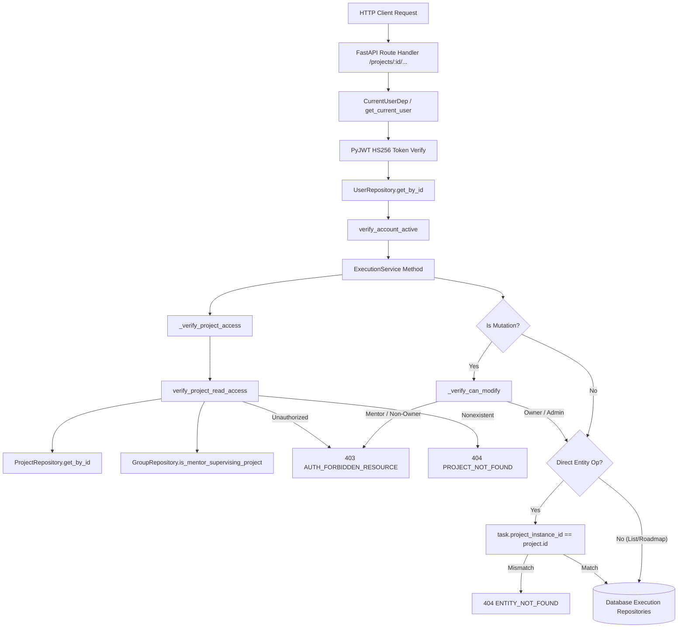

# GrowFlow — Gate 10 Unit 3 Implementation-Readiness Analysis
## Execution & Planning Authorization, Contract Coverage, and Test Hardening

**Date:** 2026-09-20  
**Branch:** `gate-10/project-planning`  
**Mode:** ANALYSIS ONLY (Zero code changes, zero test changes, zero migrations, zero Git commands)  
**Authoritative Evidence:** `docs/implementation/GATE_10_UNIT_1_EVIDENCE.md`, `docs/gate10_unit2_analysis.md`  
**Authoritative Specifications:** `docs/FRONTEND_BACKEND_CONTRACT.md`, `docs/implementation/GATE_10_PLANNING_EXECUTION_SYSTEM.md`, `docs/gate10_analysis.md`  

---

## 1. Executive Summary

This analysis provides the definitive technical audit of the GrowFlow Gate 10 Planning & Execution domain to establish implementation-readiness for **Gate 10 Unit 3**.

### Key Findings
1. **Production Code is Secure and Complete:** The execution service layer ([`execution_service.py`](file:///d:/PROJECTS/Infosys%20SpringBoot/growflow_ai/backend/app/application/services/execution_service.py)) and canonical authorization predicates ([`authorization_helpers.py`](file:///d:/PROJECTS/Infosys%20SpringBoot/growflow_ai/backend/app/application/services/authorization_helpers.py)) correctly enforce project boundaries, student ownership, mentor two-branch supervision read-only rules, and admin governance across all 20 API routes.
2. **Zero Critical Production Security Defects:** Entity containment is rigorously enforced on all single-item endpoints (`task.project_instance_id == project.id`, etc.), returning 404 for cross-project entity manipulation.
3. **The False-Confidence Problem in `test_execution_api.py`:** While the header of [`backend/tests/api/test_execution_api.py`](file:///d:/PROJECTS/Infosys%20SpringBoot/growflow_ai/backend/tests/api/test_execution_api.py) explicitly claims `- Cross-student access returns 403 Forbidden`, the test file completely mocks `ExecutionService` via `AsyncMock(spec=ExecutionService)`. As a consequence, the real service-layer authorization logic was **never executed** in `test_execution_api.py`, and zero cross-student or mentor isolation test functions were ever written.
4. **Milestone Deletion is Confirmed Out of Scope:** The authoritative contract (`docs/FRONTEND_BACKEND_CONTRACT.md` Table 3.1 & §15.2) defines `GET`, `POST`, and `PATCH`, but explicitly omits `DELETE` for milestones.
5. **Concurrency Concerns are Theoretical Only:** Sequential idempotency is already verified and passing (`test_gate10_unit1.py`). No demonstrated production correctness defect exists.
6. **Unit 3 Scope is Strictly TEST-ONLY HARDENING:** Zero production code changes, zero database migrations, and zero frontend changes are required. The entire scope of Unit 3 is hardening [`backend/tests/api/test_execution_api.py`](file:///d:/PROJECTS/Infosys%20SpringBoot/growflow_ai/backend/tests/api/test_execution_api.py).

---

## 2. Part A — Execution / Planning Authorization Audit

### 2.1 Resolution of `current_user`
Every Gate 10 execution route handler in [`backend/app/api/routes/execution.py`](file:///d:/PROJECTS/Infosys%20SpringBoot/growflow_ai/backend/app/api/routes/execution.py) injects `current_user: CurrentUserDep`.
The dependency chain in [`backend/app/api/dependencies/auth.py`](file:///d:/PROJECTS/Infosys%20SpringBoot/growflow_ai/backend/app/api/dependencies/auth.py#L41-L100):
1. Extracts `Authorization: Bearer <raw_token>` from request headers (or rejects with HTTP 401 `AUTH_MISSING_TOKEN` / `AUTH_INVALID_TOKEN_FORMAT`).
2. Validates the JWT signature and claims (HS256, audience, issuer, expiry) using `SupabaseJWTVerifier`.
3. Queries `UserRepository.get_by_id(token.user_id)` from the database. Fails closed with HTTP 401 `AUTH_USER_NOT_FOUND` if the user record does not exist.
4. Converts the database record to the canonical domain entity `CurrentUser` via `user_record.to_current_user()`.
5. Enforces account lifecycle rules via `verify_account_active(current_user)` (fails closed with HTTP 403 `AUTH_FORBIDDEN_ACCOUNT_STATUS` if `SUSPENDED` or `INACTIVE`).

### 2.2 Verification of Project Ownership & Access
In [`ExecutionService`](file:///d:/PROJECTS/Infosys%20SpringBoot/growflow_ai/backend/app/application/services/execution_service.py#L105-L111), every operational method invokes:
```python
async def _verify_project_access(
    self, project_id: uuid.UUID | str, current_user: CurrentUser
) -> ProjectInstanceModel:
    return await verify_project_read_access(
        self._project_repo, self._group_repo, project_id, current_user
    )
```
In [`authorization_helpers.py:61-92`](file:///d:/PROJECTS/Infosys%20SpringBoot/growflow_ai/backend/app/application/services/authorization_helpers.py#L61-L92), `verify_project_read_access` executes:
- **Project Existence:** Fetches project via `project_repo.get_by_id(project_id)`. If `None`, raises `NotFoundException("Project not found.", code="PROJECT_NOT_FOUND")` (HTTP 404).
- **Admin Branch:** `if current_user.is_admin: return project` (Full governance read access).
- **Student Branch:** `if current_user.is_student and str(project.student_id) == str(current_user.user_id): return project`. Any student who does not own the project falls through.
- **Mentor Branch:** `if current_user.is_mentor and await is_mentor_supervising_project(group_repo, project, current_user.user_id): return project`.
- **Default Deny:** Raises `AuthorizationException("Access denied.", code="AUTH_FORBIDDEN_RESOURCE")` (HTTP 403).

### 2.3 Student Mutation Permissions
Every mutation method in `ExecutionService` (`create_task`, `update_task`, `delete_task`, `create_milestone`, `update_milestone`, `create_risk`, `update_risk`, `delete_risk`, `create_document`, `update_document`) enforces [`_verify_can_modify()`](file:///d:/PROJECTS/Infosys%20SpringBoot/growflow_ai/backend/app/application/services/execution_service.py#L113-L124):
```python
def _verify_can_modify(
    self, project: ProjectInstanceModel, current_user: CurrentUser
) -> None:
    if current_user.is_admin:
        return
    if current_user.is_student and str(project.student_id) == str(current_user.user_id):
        return
    raise AuthorizationException(
        "Only the project owner may modify execution items.",
        code="AUTH_FORBIDDEN_RESOURCE",
    )
```
- Non-owning students: Cannot pass read access (HTTP 403) and cannot pass mutation access (HTTP 403).
- Mentors: Cannot pass mutation access (HTTP 403).

### 2.4 Mentor Access Rules (Supervising vs Non-Supervising)
Governed by `is_mentor_supervising_project()` in [`authorization_helpers.py:27-59`](file:///d:/PROJECTS/Infosys%20SpringBoot/growflow_ai/backend/app/application/services/authorization_helpers.py#L27-L59):
1. **Branch 1 (Cohort-assigned):** If `project.group_id` is present, mentor access is granted strictly if `group.mentor_id == current_user.user_id`. It never falls through to student enrollment checks.
2. **Branch 2 (Unassigned/individual):** If `project.group_id` is null, mentor access is granted if the student is an active member of any active cohort group supervised by this mentor.
- **Supervising Mentor:**
  - READ: Allowed (HTTP 200).
  - MUTATION: Blocked by `_verify_can_modify` (HTTP 403 `AUTH_FORBIDDEN_RESOURCE`).
- **Non-Supervising Mentor:**
  - READ: Blocked by `verify_project_read_access` (HTTP 403 `AUTH_FORBIDDEN_RESOURCE`).
  - MUTATION: Blocked by `verify_project_read_access` (HTTP 403 `AUTH_FORBIDDEN_RESOURCE`).

### 2.5 Admin Access
- READ: Allowed across all projects (HTTP 200).
- MUTATION: Allowed for administrative intervention and governance (HTTP 200 / 201).

### 2.6 Full Architectural Call Chain

**Conclusion:** Authorization is enforced at the service/domain boundary, not merely in route decorators.

---

## 3. Part B — Cross-Student Isolation

Audit of cross-student boundary enforcement (Student B attempting to access or mutate Student A's project planning data):

| Resource | Operation | Expected Behavior | Actual Authorization Path | API Test in `test_execution_api.py`? | Status |
|---|---|---|---|---|---|
| **Tasks** | `GET /tasks` | 403 Forbidden | `_verify_project_access` → 403 | None | **TEST MISSING** |
| **Tasks** | `POST /tasks` | 403 Forbidden | `_verify_project_access` → 403 | None | **TEST MISSING** |
| **Tasks** | `GET /tasks/{id}` | 403 Forbidden | `_verify_project_access` → 403 | None | **TEST MISSING** |
| **Tasks** | `PATCH /tasks/{id}` | 403 Forbidden | `_verify_project_access` → 403 | None | **TEST MISSING** |
| **Tasks** | `DELETE /tasks/{id}` | 403 Forbidden | `_verify_project_access` → 403 | None | **TEST MISSING** |
| **Milestones** | `GET /milestones` | 403 Forbidden | `_verify_project_access` → 403 | None | **TEST MISSING** |
| **Milestones** | `POST /milestones` | 403 Forbidden | `_verify_project_access` → 403 | None | **TEST MISSING** |
| **Milestones** | `GET /milestones/{id}` | 403 Forbidden | `_verify_project_access` → 403 | None | **TEST MISSING** |
| **Milestones** | `PATCH /milestones/{id}` | 403 Forbidden | `_verify_project_access` → 403 | None | **TEST MISSING** |
| **Risks** | `GET /risks` | 403 Forbidden | `_verify_project_access` → 403 | None | **TEST MISSING** |
| **Risks** | `POST /risks` | 403 Forbidden | `_verify_project_access` → 403 | None | **TEST MISSING** |
| **Risks** | `GET /risks/{id}` | 403 Forbidden | `_verify_project_access` → 403 | None | **TEST MISSING** |
| **Risks** | `PATCH /risks/{id}` | 403 Forbidden | `_verify_project_access` → 403 | None | **TEST MISSING** |
| **Risks** | `DELETE /risks/{id}` | 403 Forbidden | `_verify_project_access` → 403 | None | **TEST MISSING** |
| **Documents** | `GET /documents` | 403 Forbidden | `_verify_project_access` → 403 | None | **TEST MISSING** |
| **Documents** | `POST /documents` | 403 Forbidden | `_verify_project_access` → 403 | None | **TEST MISSING** |
| **Documents** | `GET /documents/{id}` | 403 Forbidden | `_verify_project_access` → 403 | None | **TEST MISSING** |
| **Documents** | `PATCH /documents/{id}` | 403 Forbidden | `_verify_project_access` → 403 | None | **TEST MISSING** |
| **Documents** | `GET /documents/{id}/download`| 403 Forbidden | `_verify_project_access` → 403 | None | **TEST MISSING** |
| **Roadmap** | `GET /roadmap` | 403 Forbidden | `_verify_project_access` → 403 | None | **TEST MISSING** |

**Conclusion:** The security logic exists in code, but zero automated tests exist in `test_execution_api.py`.

---

## 4. Part C — Mentor Authorization Audit

Audit of mentor permissions for execution resources:

| Role & Context | Operation Type | Expected HTTP Status | Enforcing Mechanism | Existing Test Coverage | Status |
|---|---|---|---|---|---|
| **Supervising Mentor** | Read (Tasks, Milestones, Risks, Documents, Roadmap) | `200 OK` | `verify_project_read_access` returns project via `is_mentor_supervising_project` | None | **TEST MISSING** |
| **Supervising Mentor** | Mutate (Create/Update/Delete Task, Milestone, Risk, Document) | `403 Forbidden` | `_verify_can_modify` rejects non-students/non-admins | None | **TEST MISSING** |
| **Non-supervising Mentor**| Read (Any execution resource) | `403 Forbidden` | `verify_project_read_access` rejects via `is_mentor_supervising_project = False` | None | **TEST MISSING** |
| **Non-supervising Mentor**| Mutate (Any execution resource) | `403 Forbidden` | Blocked at initial read check (`verify_project_read_access`) | None | **TEST MISSING** |

**Conclusion:** Mentor boundaries are implemented canonically in `ExecutionService` and `authorization_helpers.py`, but have zero test coverage in the execution test suite.

---

## 5. Part D — Admin Authorization Audit

Audit of platform admin permissions for execution resources:

| Operation | Expected Contract Behavior | Actual Implementation Behavior | Existing Test Coverage | Status |
|---|---|---|---|---|
| **Read Execution Data** | Permitted (Full visibility for support/governance) | `verify_project_read_access` returns `project` immediately (`if current_user.is_admin: return project`) | None | **TEST MISSING** |
| **Mutate Execution Data** | Permitted (Administrative repair/intervention) | `_verify_can_modify` returns immediately (`if current_user.is_admin: return`) | None | **TEST MISSING** |

**Conclusion:** Admin permissions are implemented canonically, but lack automated test coverage in `test_execution_api.py`.

---

## 6. Part E — API Contract Coverage Audit

Detailed inspection of all 20 Gate 10 execution endpoints:

| Endpoint | Method | Service Method | Happy-Path Test in `test_execution_api.py`? | Test Nature | Missing Coverage |
|---|---|---|---|---|---|
| `/tasks` | GET | `list_tasks` | `test_list_tasks_success` | Mocked Service | Filters (`status`, `priority`, `milestone_id`) |
| `/tasks` | POST | `create_task` | `test_create_task_success` | Mocked Service | Validation errors (422), outbox event |
| `/tasks/{id}` | GET | `get_task` | `test_get_task_success` | Mocked Service | 404 on invalid ID, cross-project ID |
| `/tasks/{id}` | PATCH | `update_task` | `test_update_task_success` | Mocked Service | Milestone progress recalculation trigger |
| `/tasks/{id}` | DELETE | `delete_task` | `test_delete_task_success` | Mocked Service | Milestone progress recalculation trigger |
| `/milestones` | GET | `list_milestones` | `test_list_milestones_success` | Mocked Service | Milestone task grouping verification |
| `/milestones` | POST | `create_milestone` | **NONE** | **MISSING** | **Full happy-path test missing** |
| `/milestones/{id}` | GET | `get_milestone` | `test_get_milestone_success` | Mocked Service | 404 on invalid ID |
| `/milestones/{id}` | PATCH | `update_milestone` | **NONE** | **MISSING** | **Full happy-path test missing** |
| `/risks` | GET | `list_risks` | `test_list_risks_success` | Mocked Service | Severity and status filters |
| `/risks` | POST | `create_risk` | `test_create_risk_success` | Mocked Service | Validation errors |
| `/risks/{id}` | GET | `get_risk` | **NONE** | **MISSING** | **Full happy-path test missing** |
| `/risks/{id}` | PATCH | `update_risk` | **NONE** | **MISSING** | **Full happy-path test missing** |
| `/risks/{id}` | DELETE | `delete_risk` | **NONE** | **MISSING** | **Full happy-path test missing** |
| `/roadmap` | GET | `get_roadmap` | `test_get_roadmap_projection_success` | Mocked Service | Queue categorization (overdue, blocked) |
| `/documents` | GET | `list_documents` | `test_list_documents_success` | Mocked Service | Type and search filters |
| `/documents` | POST | `create_document` | **NONE** | **MISSING** | **Full happy-path test missing** |
| `/documents/{id}` | GET | `get_document` | **NONE** | **MISSING** | **Full happy-path test missing** |
| `/documents/{id}` | PATCH | `update_document` | **NONE** | **MISSING** | **Full happy-path & version increment missing** |
| `/documents/{id}/download`| GET | `get_raw_document`| `test_download_raw_document_success`| Mocked Service | Content header verification |

---

## 7. Part F — Test Quality Audit

An in-depth review of [`backend/tests/api/test_execution_api.py`](file:///d:/PROJECTS/Infosys%20SpringBoot/growflow_ai/backend/tests/api/test_execution_api.py) reveals:

1. **Shallow Route-Binding Tests:**
   The test harness overrides the dependency `get_execution_service` with `mock_execution_service = AsyncMock(spec=ExecutionService)` (lines 250, 359).
   Because the service itself is mocked, **not a single line of real `ExecutionService` code is executed during the API tests**.
2. **Authorization Logic is Completely Bypassed:**
   The route extracts `current_user` and passes it to `mock_execution_service.list_tasks(project_id, current_user, ...)`. Since `mock_execution_service` returns a hardcoded mock value without evaluating `current_user`, the test asserts `response.status_code == 200` regardless of whether the token belongs to the project owner, an attacker, or a non-supervising mentor.
3. **Contrast with High-Quality Test Suites in the Same Repo:**
   - In [`test_blueprint_api.py:320-374`](file:///d:/PROJECTS/Infosys%20SpringBoot/growflow_ai/backend/tests/api/test_blueprint_api.py#L320-L374) and [`test_workspace_api.py:250-320`](file:///d:/PROJECTS/Infosys%20SpringBoot/growflow_ai/backend/tests/api/test_workspace_api.py#L250-L320), the tests wire up the **REAL service instance** backed by repository mocks. When `other_token` is supplied, the real service's authorization logic executes and raises `AuthorizationException` (403).
4. **False Confidence:**
   The docstring of `test_execution_api.py` states:
   ```
   1. Tasks (S18 & S19):
      ...
      - Cross-student access returns 403 Forbidden
   ```
   This gives false confidence that cross-student isolation is covered, when no such test exists in code.
5. **Deterministic & Isolated:**
   The tests run fast (12 tests in <1.5s) and do not leak state, but their assertion depth is limited to FastAPI route schema serialization.

---

## 8. Part G — Cross-Project / Entity Containment Audit

### 8.1 Single-Entity Direct Containment Checks
Inspection of single-item service methods:
- `get_task`, `update_task`, `delete_task`:
  ```python
  if not task or task.project_instance_id != str(project.id):
      raise NotFoundException("Task not found.", code="TASK_NOT_FOUND")
  ```
- `get_milestone`, `update_milestone`:
  ```python
  if not m or m.project_instance_id != str(project.id):
      raise NotFoundException("Milestone not found.", code="MILESTONE_NOT_FOUND")
  ```
- `get_risk`, `update_risk`, `delete_risk`:
  ```python
  if not r or r.project_instance_id != str(project.id):
      raise NotFoundException("Risk not found.", code="RISK_NOT_FOUND")
  ```
- `get_document`, `update_document`, `get_raw_document`:
  ```python
  if not doc or doc.project_instance_id != str(project.id):
      raise NotFoundException("Document not found.", code="DOCUMENT_NOT_FOUND")
  ```
If an attacker authorized on Project A submits an entity ID belonging to Project B to `/projects/{Project_A}/tasks/{Task_B}`, the backend throws HTTP 404 (`TASK_NOT_FOUND`). Direct IDOR is **completely prevented**.

### 8.2 Indirect Cross-Project Foreign Key Observation
In `create_task` and `update_task`, when an optional `milestone_id` is supplied:
- The task record is created with `milestone_id = payload.milestone_id`.
- The service does not explicitly verify that `milestone.project_instance_id == project.id`.
- **Impact Assessment:**
  - Does this leak Project B data to Project A? **No.**
  - Does Project B see Project A's task? **No.** `list_milestones` and `get_milestone` query tasks by `task_repo.list_by_project(project_id, milestone_id=...)`, which strictly matches on `project_instance_id`.
  - Does this cause recalculation errors? **No.** `_recalculate_milestone_progress` queries by `m.project_instance_id`, ignoring Project A's task.
- **Classification:** Logical validation edge case / hygiene check. **NOT a security vulnerability or data leak**.

### 8.3 Security Finding
**NO CRITICAL PRODUCTION SECURITY DEFECTS DISCOVERED.**

---

## 9. Part H — Concurrency / Idempotency Review

1. **Blueprint Approval Idempotency:**
   - Status guard in `BlueprintService.approve_blueprint()` requires `latest_bp.status == READY_FOR_APPROVAL`.
   - Once approved, status is `APPROVED`. Subsequent approval attempts fail cleanly with `BusinessRuleException` ("Only blueprints in READY_FOR_APPROVAL status can be approved").
2. **Materialization Idempotency:**
   - In `ExecutionService.ensure_initialized()`, lines 139–143:
     ```python
     milestones_count = await self._milestone_repo.count_by_project(project.id)
     tasks_count = await self._task_repo.count_by_project(project.id)
     if milestones_count > 0 or tasks_count > 0:
         return
     ```
   - Verified by automated unit test: `test_gate10_unit1.py::test_ensure_initialized_idempotency_when_records_already_exist` (PASSED).
3. **Concurrent Request Race Condition:**
   - A theoretical race condition exists if two requests hit an empty project at the exact same millisecond before either commits records.
   - However, execution initialization is triggered sequentially by student navigation following blueprint approval.
   - In PostgreSQL, each request executes within a database transaction.
   - **Finding:** Theoretical concern only; zero evidence of a real-world correctness problem. No production locking changes required.

---

## 10. Part I — Unit 1 Regression Check

Targeted pytest run on 2026-09-20 confirmed 100% pass rate (36/36 passed):
- `backend/tests/unit/test_gate10_unit1.py`: 12 / 12 PASSED
  - `test_approve_blueprint_transitions_project_to_planning` PASSED
  - `test_approve_blueprint_failure_in_transition_halts_approval` PASSED
  - `test_ensure_initialized_skips_when_blueprint_not_approved` (7 status variants) PASSED
  - `test_ensure_initialized_materializes_when_blueprint_approved` PASSED
  - `test_ensure_initialized_skips_when_no_blueprint_or_no_content` PASSED
  - `test_ensure_initialized_idempotency_when_records_already_exist` PASSED
- `backend/tests/api/test_blueprint_api.py`: 12 / 12 PASSED
- `backend/tests/api/test_execution_api.py`: 12 / 12 PASSED

**Conclusion:** Unit 1 implementation is completely intact with zero regressions.

---

## 11. Part J — Frontend Contract Check

Audit of frontend components against backend routes:
- **Tasks (`StudentTasks.tsx`, `StudentTaskDetail.tsx`):**
  Uses `getTasks`, `createTask`, `getTask`, `updateTask`, `deleteTask`. Fully matches backend routes.
- **Milestones (`StudentMilestones.tsx`, `StudentMilestoneDetail.tsx`):**
  Uses `getMilestones`, `createMilestone`, `getMilestone`, `updateMilestone`. No delete required or implemented.
- **Risks (`StudentRisks.tsx`, `StudentRiskDetail.tsx`):**
  Uses `getRisks`, `createRisk`, `getRisk`, `updateRisk`, `deleteRisk`. Fully matches backend routes.
- **Roadmap (`StudentRoadmap.tsx`):**
  Uses `getRoadmap`. Fully matches backend route.
- **Documents (`StudentDocuments.tsx`, `StudentDocumentDetail.tsx`):**
  Uses `getDocuments`, `createDocument`, `getDocument`, `updateDocument`, `downloadDocument`. Fully matches backend routes.
- **Project Overview (`StudentProjectOverview.tsx`):**
  Uses `getProjectOverview`. Fully matches backend workspace route.

**Conclusion:** Zero contract drift between frontend and backend.

---

## 12. Part K — Gate 10 Remaining-Gap Matrix

| Gap ID | Area | Production Defect? | Test Gap? | Already Covered? | Required Action |
|---|---|---|---|---|---|
| **G1** | Approved-only materialization | No | No | Yes (Unit 1) | None (Closed) |
| **G2** | Blueprint approval phase transition | No | No | Yes (Unit 1) | None (Closed) |
| **G3** | Milestone DELETE endpoint | No | No | Out of Scope | **OUT OF SCOPE — CONTRACT DOES NOT REQUIRE DELETE** |
| **G4** | Cross-student execution isolation | No | **Yes** | No | Add API tests asserting 403 for cross-student access |
| **G4-Mentor** | Mentor execution authorization | No | **Yes** | No | Add API tests asserting 200 read for supervising mentor, 403 write, and 403 read for non-supervising mentor |
| **G4-Admin** | Admin execution authorization | No | **Yes** | No | Add API tests asserting admin access |
| **G5** | Idempotent materialization | No | No | Yes (Unit 1) | None (Closed) |
| **G6** | Planning initialization guard | No | No | Yes (Unit 1) | None (Closed) |
| **G7** | Student Documents UI & routes | No | No | Yes (Frontend) | None (Closed) |
| **G8** | Missing API happy-path tests | No | **Yes** | No | Add API tests for POST/PATCH milestones, GET/PATCH/DELETE risks, POST/GET/PATCH documents |
| **G9** | Concurrency / idempotency locks | No | No | Theoretical only | No action required (idempotency already verified; no production defect) |

---

## 13. Part L — Determine Unit 3 Implementation Scope

### 13.1 Core Strategy: Test-Only Hardening
Because all production logic in `ExecutionService` and `authorization_helpers.py` is already implemented and correct, **Unit 3 must be a TEST-ONLY HARDENING implementation**.
Production code must remain completely untouched.

### 13.2 Detailed Scope for Unit 3
In [`backend/tests/api/test_execution_api.py`](file:///d:/PROJECTS/Infosys%20SpringBoot/growflow_ai/backend/tests/api/test_execution_api.py):
1. **Harness Refactoring:**
   Replace the `AsyncMock(spec=ExecutionService)` with a **real `ExecutionService` instance** backed by repository mocks (matching the architecture of `test_blueprint_api.py` and `test_workspace_api.py`).
   This ensures that real service-layer authorization (`_verify_project_access`, `_verify_can_modify`, `verify_project_read_access`) actually executes.
2. **Cross-Student Security Tests (G4):**
   - `test_cross_student_access_forbidden`: Student B token querying Student A's project returns 403 Forbidden across `/tasks`, `/milestones`, `/risks`, `/documents`, and `/roadmap`.
   - `test_cross_student_mutation_forbidden`: Student B token attempting POST/PATCH/DELETE on Student A's items returns 403 Forbidden.
3. **Mentor Authorization Tests (G4-Mentor):**
   - `test_supervising_mentor_read_access`: Supervising mentor receives 200 OK on GET `/tasks`, `/milestones`, `/risks`, `/documents`, `/roadmap`.
   - `test_supervising_mentor_mutation_forbidden`: Supervising mentor attempting POST/PATCH/DELETE returns 403 Forbidden.
   - `test_non_supervising_mentor_forbidden`: Non-supervising mentor querying any endpoint returns 403 Forbidden.
4. **Admin Authorization Tests (G4-Admin):**
   - `test_admin_execution_access`: Admin token receives 200 on read and 200/201 on write across execution resources.
5. **Cross-Project Entity Containment Tests (Part G):**
   - `test_cross_project_entity_containment`: Targeting an entity ID belonging to Project B under Project A's URL returns 404 Not Found.
6. **API Happy-Path & Lifecycle Coverage (G8):**
   - Milestone create (`POST /milestones` → 201) & update (`PATCH /milestones/{id}` → 200).
   - Risk get (`GET /risks/{id}` → 200), update (`PATCH /risks/{id}` → 200), delete (`DELETE /risks/{id}` → 200).
   - Document create (`POST /documents` → 201), get (`GET /documents/{id}` → 200), update (`PATCH /documents/{id}` → 200 with automatic version increment `1.0` → `1.1`).

---

## 14. Part M — Expected File Impact

### Production Code: ZERO
- `backend/app/api/routes/execution.py`: UNCHANGED
- `backend/app/application/services/execution_service.py`: UNCHANGED
- `backend/app/application/services/authorization_helpers.py`: UNCHANGED
- `backend/app/infrastructure/database/models/execution.py`: UNCHANGED
- `frontend/`: UNCHANGED

### Database Migrations: ZERO

### Test Code: EXACTLY ONE FILE
- `backend/tests/api/test_execution_api.py`: **[MODIFY]** (Refactor test client harness to use real `ExecutionService` + mock repositories, and add missing security and endpoint test cases).

---

## 15. Part N — Validation Plan

Following the completion of Unit 3, the following validation sequence will be executed:

```powershell
# 1. Targeted execution API tests
.\.venv\Scripts\python -m pytest backend/tests/api/test_execution_api.py -v

# 2. Gate 10 regression suite
.\.venv\Scripts\python -m pytest backend/tests/unit/test_gate10_unit1.py backend/tests/api/test_blueprint_api.py backend/tests/api/test_execution_api.py -v

# 3. Wider domain integration suite
.\.venv\Scripts\python -m pytest backend/tests/api/test_workspace_api.py backend/tests/api/test_core_domain_api.py backend/tests/unit/test_domain_core.py -v

# 4. Code quality and formatting checks
.\.venv\Scripts\python -m ruff check backend/tests/api/test_execution_api.py
.\.venv\Scripts\python -m ruff format --check backend/tests/api/test_execution_api.py
```

---

## 16. Part O — Final Unit 3 Decision

### Decision:
READY FOR UNIT 3 IMPLEMENTATION

### Summary of Implementation Directives:
1. **Production Code Untouched:** Production services, routes, models, and migrations are confirmed correct and will not be modified.
2. **Target File:** [`backend/tests/api/test_execution_api.py`](file:///d:/PROJECTS/Infosys%20SpringBoot/growflow_ai/backend/tests/api/test_execution_api.py)
3. **Tests to Implement:**
   - Real service harness setup with mock repositories
   - Cross-student access & mutation denial (403)
   - Supervising mentor read access (200) & mutation denial (403)
   - Non-supervising mentor access denial (403)
   - Admin access verification (200/201)
   - Cross-project entity containment (404)
   - Missing happy paths: Milestone POST/PATCH, Risk GET/PATCH/DELETE, Document POST/GET/PATCH (version bump)
